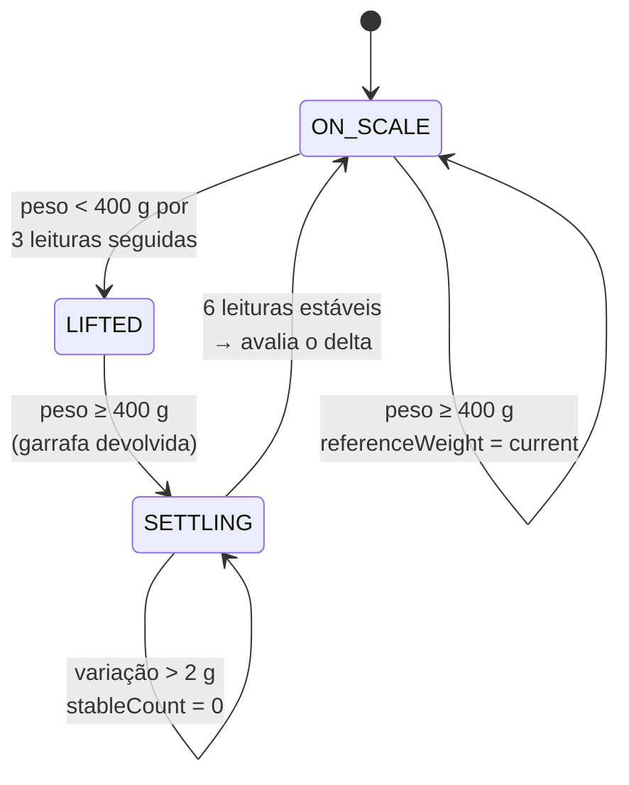
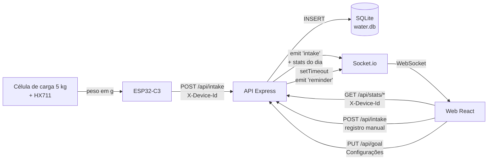
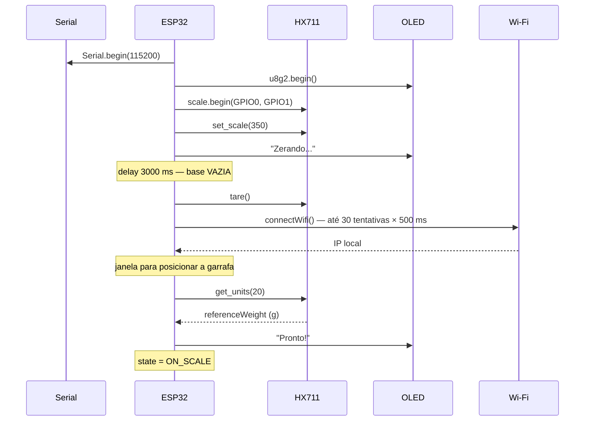
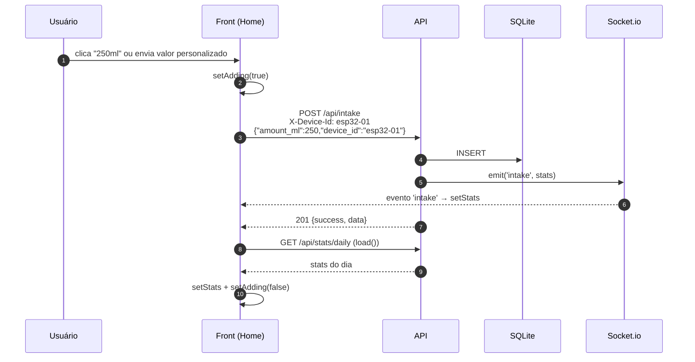
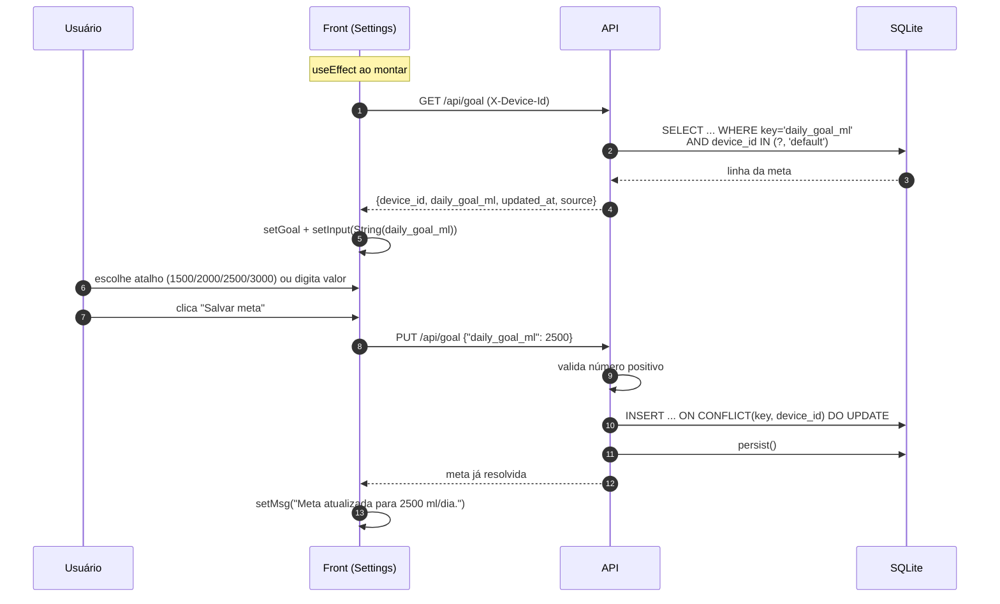
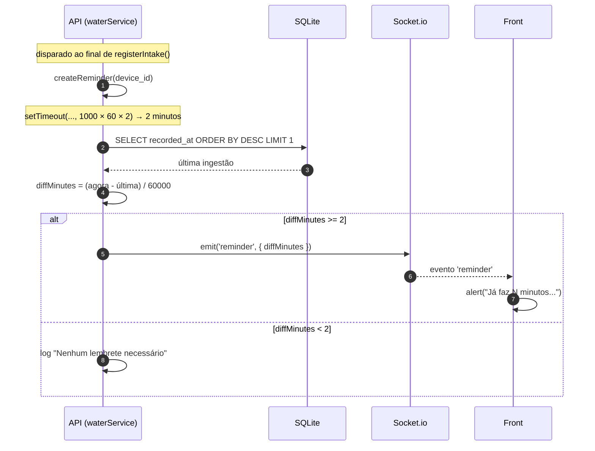
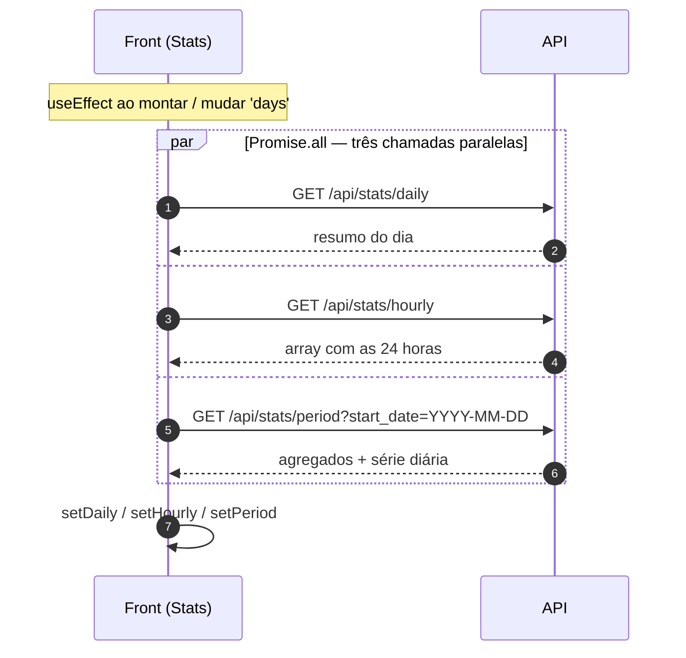
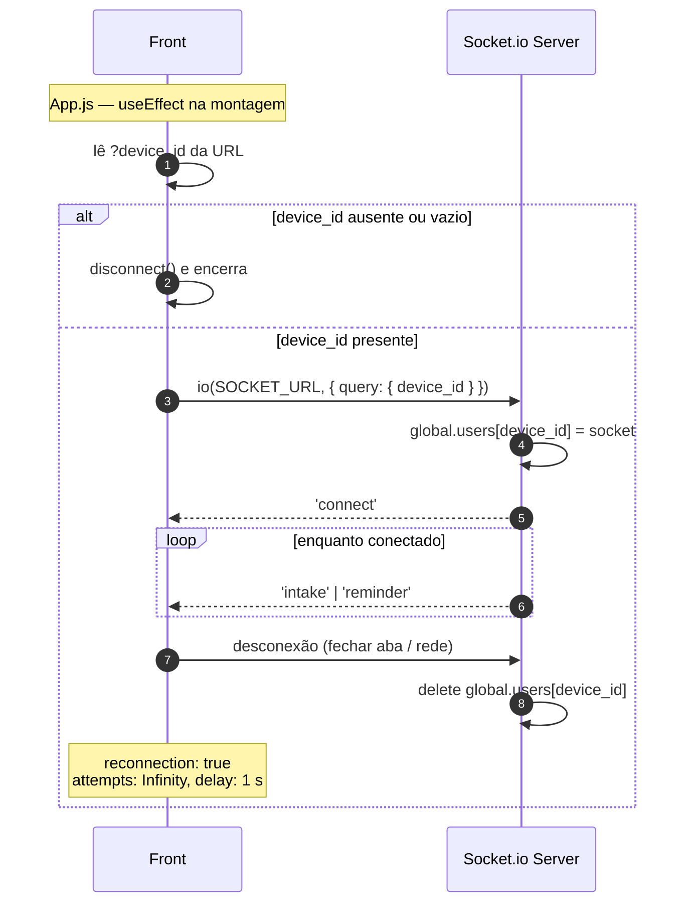

# Water Intake — WI

Sistema completo de monitoramento de hidratação que combina **hardware, backend e frontend** para registrar automaticamente a quantidade de água consumida ao longo do dia.

Uma célula de carga posicionada sob a garrafa detecta a variação de peso, o ESP32 processa os dados e envia as informações via Wi-Fi para uma API, e o usuário acompanha o progresso em tempo real por um aplicativo web.

---

## Sumário

**Parte I — Concepção e dispositivo**

1. [Introdução](#1-introdução)
2. [Componentes utilizados](#2-componentes-utilizados)
3. [Como a célula de carga e o HX711 funcionam](#3-como-a-célula-de-carga-e-o-hx711-funcionam)

**Parte II — Arquitetura e integração**

4. [Visão geral do sistema](#4-visão-geral-do-sistema)
5. [Conceito central: o `device_id`](#5-conceito-central-o-device_id)
6. [Firmware do ESP32 em detalhe](#6-firmware-do-esp32-em-detalhe)
7. [Fluxo de dados ESP32 → API → Front](#7-fluxo-de-dados-esp32--api--front)

**Parte III — Referência técnica**

8. [Funcionalidades por módulo](#8-funcionalidades-por-módulo)
9. [Referência da API REST](#9-referência-da-api-rest)
10. [Referência dos eventos WebSocket](#10-referência-dos-eventos-websocket)
11. [Modelo de dados](#11-modelo-de-dados)
12. [Configuração e execução](#12-configuração-e-execução)
13. [Matriz de rastreabilidade](#13-matriz-de-rastreabilidade)

**Parte IV — Evolução**

14. [Próximos passos](#14-próximos-passos)

---

# Parte I — Concepção e dispositivo

## 1. Introdução

O WI (nome provisório) é um sistema completo de monitoramento de hidratação que combina hardware, backend e frontend para registrar automaticamente a quantidade de água consumida ao longo do dia.

Uma célula de carga posicionada sob a garrafa de água detecta a variação de peso, o ESP32 processa os dados e envia as informações via Wi-Fi para uma API, e o usuário acompanha o progresso em tempo real por um aplicativo.

### 1.1 Motivação

A ideia partiu de uma motivação pessoal de desenvolvimento de algum dispositivo de wellness ou de segurança pessoal para uso próprio. Antes da ideia final, algumas possibilidades foram levantadas:

1. **Sensor de porta** que envia notificação quando a porta for aberta, gerando alertas urgentes em horários críticos → descartada por pesquisa de mercado, onde foram encontrados diversos dispositivos semelhantes e com integrações mais completas (como Alexa e Google Home). Foi recomendado pelo professor a realização de uma pesquisa sobre a área da domótica, que, em uma validação do mercado, foi possível identificar que não haveria muito espaço para "ideias inovadoras" de baixo custo.
2. **Medidor e regulador de stress** → descartada por conta da complexidade de desenvolvimento e calibração do dispositivo wearable dentro do tempo da disciplina. Também foi conferido que alguns smartwatches já possuem funcionalidades parecidas integradas.
3. **Botão de emergência para carro** que envia localização para contatos de emergência → descartada em uma conversa com um Uber que já possuía um dispositivo com propósito parecido e bem mais completo em termos de funcionalidade.

### 1.2 Concepção da ideia

Após o insucesso das ideias anteriores, surgiu a ideia de um dispositivo que acompanha a ingestão de água, também por conta de uma motivação pessoal e insatisfação com os aplicativos existentes para esse fim, onde é necessário cadastrar manualmente a quantidade de água ingerida, gerando dificuldades de aderência ao uso.

O dispositivo desenvolvido ficaria acoplado à base da garrafa para acompanhamento da ingestão através da variação de peso para baixo, com a geração de lembretes para ingestão e envio de estatísticas a um aplicativo.

Em pesquisa de mercado foram encontradas garrafas inteiras com esse mecanismo a preço bastante elevado, e o [Ulla](https://www.ulla.io), um gadget simples que detecta o movimento da garrafa para criar alertas e não se conecta com nenhum sistema. A proposta do dispositivo a ser desenvolvido, então, se diferencia ao possibilitar o acoplamento a qualquer garrafa através de uma base removível, além da integração com o aplicativo.


### 1.3 A premissa física

A premissa é simples: se a garrafa ficou mais leve entre duas medições estáveis, a diferença corresponde ao volume ingerido — para água, **1 g ≈ 1 ml**, porque a densidade da água a temperatura ambiente é praticamente 1 g/cm³.

Essa equivalência é o motivo de a conversão nunca aparecer explicitamente no código: o firmware calcula uma diferença **em gramas** e a envia no campo `amount_ml` sem multiplicar por nada. Toda a inteligência do sistema é construída sobre essa relação.

```
delta [g] = referenceWeight - current      →  enviado como amount_ml
```

---

## 2. Componentes utilizados


### 2.1 Dispositivo

| Componente | Especificação | Papel no projeto |
|------------|---------------|------------------|
| Placa microcontroladora | ESP32-C3 Super Mini com display OLED de 0.42'' integrado | Cérebro: lê o HX711, roda a máquina de estados, conecta no Wi-Fi e envia HTTP |
| Célula de carga | Barra de alumínio, capacidade **até 5 kg** | Transdutor: converte força (peso) em desequilíbrio elétrico |
| Placa HX-711 | Amplificador + conversor A/D de 24 bits dedicado a células de carga | Excita a ponte, amplifica os microvolts e digitaliza |
| Jumpers | 4 jumpers **fêmea-fêmea** | Ligação HX711 ↔ ESP32-C3 |

**Conexões HX711 ↔ ESP32-C3** (os 4 jumpers fêmea-fêmea):

| HX711 | ESP32-C3 |
|-------|----------|
| VCC   | 3V       |
| GND   | GND      |
| DT    | GPIO 0   |
| SCK   | GPIO 1   |

**Conexões célula de carga ↔ HX711** (os 4 fios que saem da célula):

| Fio da célula | HX711 | Função |
|---------------|-------|--------|
| Vermelho | E+ | Excitação positiva (alimentação da ponte) |
| Preto    | E− | Excitação negativa (referência da ponte) |
| Branco   | A− | Sinal negativo do canal A |
| Verde    | A+ | Sinal positivo do canal A |

> São **quatro** fios, não três: dois de excitação e **dois de sinal**. Isso significa que a célula é uma **ponte de Wheatstone completa**, com os quatro braços ativos — e não uma meia-ponte. A consequência prática está detalhada na [seção 3](#3-como-a-célula-de-carga-e-o-hx711-funcionam): sensibilidade quatro vezes maior e compensação térmica intrínseca.


**Pinagem efetiva no firmware** (`esp32/esp32.ino`):

| Função | Pino | Constante |
|--------|------|-----------|
| HX711 DT (DOUT) | GPIO 0 | `PIN_DOUT` |
| HX711 SCK | GPIO 1 | `PIN_SCK` |
| OLED SDA | GPIO 5 | `OLED_SDA` |
| OLED SCL | GPIO 6 | `OLED_SCL` |

O display físico é de 72×40 px dentro de um controlador SSD1306 de 128×64, daí os deslocamentos `xOffset = 30` e `yOffset = 12` aplicados em `showDisplay()`. Sem eles, o texto seria desenhado no canto superior esquerdo do *buffer*, que fica fora da área de vidro visível.

### 2.2 Materiais complementares

* Protoboard (para testes iniciais)
* Kit de Ferro de Solda 60W com Estanho
* Base de silicone de garrafa para acoplamento final

### 2.3 Montagem mecânica

A célula de carga **só mede corretamente se for montada em balanço** (*cantilever*): uma extremidade fixa rigidamente à base e a outra livre, recebendo a carga. A seta gravada no corpo da célula indica o sentido da força.

```
        garrafa
          ↓ ↓ ↓
    ┌───────────────┐  ← plataforma superior (recebe a carga)
    │               │
    ╞═══════════════╡  ← célula de carga: extremidade esquerda parafusada,
    │               │     extremidade direita livre → a barra flexiona
    └───────────────┘  ← base fixa (base de silicone da garrafa)
```

Se as duas extremidades forem parafusadas na mesma superfície rígida, a barra não flexiona, os *strain gauges* não deformam e a leitura fica praticamente constante — um erro clássico de montagem.

---

## 3. Como a célula de carga e o HX711 funcionam

Esta seção existe porque o coração do projeto não é o software: é a cadeia de medição que transforma o peso da garrafa em um número. Sem entender essa cadeia, as constantes do firmware parecem arbitrárias.

### 3.1 O que há dentro da célula de carga

A célula é uma **barra de alumínio usinada** com quatro *extensômetros* (**strain gauges**) colados na região de maior deformação. Um *strain gauge* é uma grelha de filme metálico muito fino: quando o material sob ele se alonga, a grelha se alonga junto, ficando mais comprida e mais estreita — e, portanto, **mais resistiva**. Quando comprime, acontece o inverso.

A relação é linear e caracterizada pelo **fator de sensibilidade** (*gauge factor*, GF ≈ 2 para ligas de constantã):

```
ΔR / R = GF × ε          onde ε = deformação (ΔL / L)
```

O problema: a deformação útil é da ordem de **500 µε** (0,05 %) na carga máxima. Com GF = 2, isso dá `ΔR/R = 0,001` — ou seja, **0,1 %** de variação. Em um *gauge* de 1 kΩ, é uma variação de 1 Ω. Medir 1 Ω em cima de 1000 Ω diretamente com um ohmímetro é inviável na presença de ruído e deriva térmica.

### 3.2 A ponte de Wheatstone completa

A solução, com quase dois séculos de idade, é a **ponte de Wheatstone**: quatro resistências em losango, alimentadas por uma tensão de excitação `Vex` entre E+ e E−, com a saída lida entre A+ e A−.

```
              E+  (Vermelho)
               │
        ┌──────┴──────┐
        │             │
       R1(+)         R4(−)
        │             │
 A+ ────┤             ├──── A−
(Verde) │             │  (Branco)
       R2(−)         R3(+)
        │             │
        └──────┬──────┘
               │
              E−  (Preto)
```

Com a barra em repouso a ponte está **equilibrada** e a saída é zero. Sob carga, dois *gauges* ficam tracionados (resistência sobe) e dois comprimidos (resistência desce), e a ponte desequilibra. É exatamente por isso que a célula tem **quatro fios**: dois para excitar (Vermelho/Preto) e dois para ler o sinal diferencial (Verde/Branco).

Como **os quatro braços são ativos** — e não apenas um ou dois —, a ponte completa entrega:

```
Vsaída / Vex  =  GF × ε  =  ΔR / R
```

Três consequências que importam para este projeto:

1. **Sensibilidade máxima.** Um único *gauge* daria um quarto desse sinal; uma meia-ponte (dois braços ativos), metade. A ponte completa é a configuração mais sensível possível.
2. **Compensação térmica intrínseca.** Alumínio dilata com a temperatura e os *gauges* mudam de resistência junto. Como os quatro sofrem a **mesma** variação térmica e ela aparece igualmente nos dois ramos do losango, o efeito **se cancela na diferença** A+ − A−. Sem isso, a leitura derivaria ao longo do dia só pela variação da temperatura ambiente.
3. **Rejeição de modo comum.** Ruído captado pelos fios afeta A+ e A− igualmente e some na subtração, desde que o amplificador seja diferencial — que é justamente o caso do HX711.

### 3.3 Quanto sinal isso realmente produz

Aqui está o número que justifica todo o resto do hardware. A especificação usual dessas células é **≈ 1 mV/V** de sensibilidade na carga nominal. Com a célula de **5 kg** deste projeto e a excitação de ≈ 4,3 V gerada pelo próprio HX711:

| Grandeza | Cálculo | Valor |
|----------|---------|-------|
| Saída na carga máxima (5 kg) | 1 mV/V × 4,3 V | **4,3 mV** |
| Saída por grama | 4,3 mV ÷ 5000 g | **≈ 0,86 µV/g** |
| Um gole de 250 ml | 250 × 0,86 µV | **≈ 215 µV** |
| Uma garrafa cheia de 1 L sobre a base | 1000 × 0,86 µV | **≈ 0,86 mV** |

**Menos de um microvolt por grama.** Para comparação, o ruído térmico e a interferência de rede captados por um par de fios sem blindagem ficam facilmente nessa mesma ordem de grandeza. É por isso que o sensor não pode ser ligado direto no microcontrolador.

> **Por que 5 kg e não 50 kg?** A sensibilidade em µV/g é inversamente proporcional à capacidade da célula. Uma célula de 50 kg entregaria os mesmos 4,3 mV, porém espalhados por dez vezes mais carga — cerca de **0,086 µV/g**, um décimo do sinal, para medir exatamente a mesma garrafa. Escolher a menor capacidade que ainda suporte a carga real (garrafa cheia ≈ 1,5 kg, com folga confortável até 5 kg) é o que maximiza a resolução útil.

### 3.4 Por que o ESP32 não consegue ler a célula sozinho

O ESP32-C3 tem um ADC interno de 12 bits. Comparando as duas escalas:

| | ADC interno do ESP32-C3 | HX711 |
|---|---|---|
| Resolução | 12 bits | 24 bits |
| Faixa de entrada | 0–3,3 V (single-ended) | ±20 mV (diferencial, ganho 128) |
| Degrau (1 LSB) | ≈ **806 µV** | ≈ **2 nV** |
| Gramas por degrau | ≈ **940 g** | ≈ 0,003 g (teórico) |
| Entrada diferencial | não | sim |
| Excitação da ponte | externa | integrada (AVDD ≈ 4,3 V) |

Ler a célula direto no ADC do ESP32 significaria precisar de quase **um quilo de água** para mover um único degrau da conversão — e ainda por cima o sinal é diferencial e flutua em torno de um modo comum de ≈ 2,15 V, que um ADC single-ended não sabe rejeitar. O HX711 não é uma conveniência: é uma necessidade.

### 3.5 O que o HX711 faz

O HX711 é um front-end analógico **feito especificamente para células de carga**. Ele resolve quatro problemas de uma vez:

1. **Excita a ponte.** Gera internamente a tensão de alimentação da célula (AVDD, tipicamente 4,3 V) a partir de um regulador on-chip, com a mesma referência usada pelo conversor. Isso cria uma medida **ratiométrica**: se a excitação oscilar, a referência do ADC oscila junto e a razão se mantém — o resultado não muda.
2. **Amplifica.** Um PGA (amplificador de ganho programável) com ganho fixo de **128** no canal A, dedicado justamente a sinais de ponte. Os 4,3 mV de fundo de escala viram ≈ 0,55 V na entrada do conversor.
3. **Converte.** Um ADC **sigma-delta de 24 bits**, arquitetura que troca velocidade por resolução — ideal para peso, que muda devagar. Na prática, a resolução livre de ruído fica em torno de 15 a 18 bits, o que ainda é ordens de grandeza melhor que os 12 bits do ESP32.
4. **Filtra a rede elétrica.** O filtro digital do sigma-delta tem rejeição de 50/60 Hz embutida, atenuando o zumbido da rede que domina medidas de baixo nível.

Taxa de amostragem: **10 SPS** por padrão (pino RATE em nível baixo), ou 80 SPS se puxado para VCC. Os 10 SPS são os que interessam aqui — e têm efeito direto no tempo de resposta do firmware, como mostra a [seção 6.4](#64-o-custo-real-de-cada-leitura).

### 3.6 O protocolo do HX711: dois fios, mas não é I²C nem SPI

O HX711 usa um protocolo **proprietário de dois fios** que a biblioteca `HX711.h` esconde do usuário. Vale conhecê-lo porque explica o significado dos pinos DT e SCK:

| Fio | Direção | Papel |
|-----|---------|-------|
| **DT / DOUT** (GPIO 0) | HX711 → ESP32 | Dado serial **e** sinal de "pronto" |
| **SCK** (GPIO 1) | ESP32 → HX711 | Clock gerado pelo mestre **e** comando de power-down |

O ciclo completo:

1. **Espera.** Enquanto a conversão não termina, o HX711 mantém DOUT em **nível alto**. O ESP32 fica em *polling* nesse pino — ou seja, `DOUT` em nível **baixo** significa "amostra pronta".
2. **Leitura.** O ESP32 gera **24 pulsos** em SCK. A cada borda de subida o HX711 coloca um bit em DOUT, do mais significativo para o menos significativo, em **complemento de dois** — o valor pode ser negativo, o que acontece sempre que a carga atual está abaixo do ponto de tara.
3. **Seleção do próximo canal/ganho.** Depois dos 24 bits, o número de **pulsos extras** define a configuração da conversão seguinte:

| Pulsos totais | Canal | Ganho |
|---------------|-------|-------|
| 25 | A | 128 ← usado neste projeto |
| 26 | B | 32 |
| 27 | A | 64 |

4. **Power-down.** Manter SCK em nível alto por mais de **60 µs** coloca o chip em repouso (< 1 µA). Uma borda de descida o traz de volta. É esse mecanismo que a biblioteca usa em `power_down()` / `power_up()` — recurso relevante para uma futura versão a bateria.

Note que **não há endereçamento**: o barramento é ponto a ponto. Dois HX711 exigiriam dois pares de pinos, ou o compartilhamento de SCK com DOUTs separados.

### 3.7 Calibração: do valor bruto ao grama

O ADC entrega uma contagem crua sem significado físico. A conversão é uma reta de dois parâmetros:

```
peso [g] = (leitura_bruta − offset) ÷ fator_de_calibração
```

| Parâmetro | Método | No firmware |
|-----------|--------|-------------|
| `offset` (tara) | Média das leituras com a base **vazia** | `scale.tare()` |
| `fator` (escala) | Contagens por grama, obtido com uma massa conhecida | `scale.set_scale(350)` |

O procedimento empírico é: zerar a base vazia, colocar um objeto de massa conhecida, dividir a contagem crua obtida pela massa em gramas. O resultado, **350 contagens por grama**, é a constante `CALIBRATION_FACTOR` do sketch.

**Esse número bate com a teoria?** Vale conferir, porque é um bom teste de sanidade da montagem:

```
sinal por grama          ≈ 860 nV/g                (seção 3.3)
degrau do HX711 (G=128)  ≈ 2,05 nV/contagem        (±17,2 mV em 2^24 passos)
                          ─────────────────────
previsão teórica         ≈ 420 contagens/g
valor calibrado          =  350 contagens/g
```

Diferença de cerca de 17 %, perfeitamente compatível com a tolerância de sensibilidade da célula (o "1 mV/V" nominal costuma ter ±15 % de dispersão) e com a geometria real da montagem — a garrafa não fica exatamente sobre o eixo de aplicação previsto. **A ordem de grandeza confere, e é isso que valida a montagem.**

Duas verificações derivadas:

- **Uso da faixa:** 5000 g × 350 = 1.750.000 contagens, contra ±8.388.608 disponíveis no ADC de 24 bits. O sistema ocupa cerca de **21 %** da escala — sobra folga de sobra e não há risco de saturação com uma garrafa cheia.
- **Ruído prático:** embora um degrau valha teóricos ~3 mg, o ruído real de uma montagem caseira fica na casa de **0,5 a 2 g**. É exatamente por isso que `STABLE_THRESHOLD` vale **2.0 g**: abaixo disso, "variação" é ruído, não água.

> **A tara é sempre relativa ao instante do boot.** `scale.tare()` zera o que estiver sobre a base naquele momento. Se o dispositivo ligar com a garrafa em cima, ela vira o novo zero e o peso absoluto fica deslocado — por isso o procedimento correto é **ligar com a base vazia**.

---

# Parte II — Arquitetura e integração

## 4. Visão geral do sistema

```
        ┌─────────────────────────┐
        │   Garrafa do usuário    │
        └───────────┬─────────────┘
                    │ força (peso)
        ┌───────────▼─────────────┐
        │ Célula de carga  5 kg   │   ponte de Wheatstone completa
        │   4 fios → HX711        │   E+/E− excitação, A+/A− sinal
        └───────────┬─────────────┘
                    │ DT/SCK (GPIO 0/1) — protocolo de 2 fios
        ┌───────────▼─────────────┐
        │  ESP32-C3 Super Mini    │   display OLED 0.42"
        │     esp32/esp32.ino     │   mostra peso + "WI!" + device_id
        └───────────┬─────────────┘
                    │ HTTP POST (Wi-Fi)
        ┌───────────▼─────────────┐
        │   API Node.js/Express   │◄──── REST (GET stats, POST intake, PUT goal)
        │   SQLite via sql.js     │
        │   :4000 HTTP            │
        │   :4001 Socket.io       │────► WebSocket (intake, reminder)
        └───────────┬─────────────┘
                    │
        ┌───────────▼─────────────┐
        │  Web React 18           │   3 abas: Início · Estatísticas · Configurações
        │  ?device_id=esp32-01    │
        └─────────────────────────┘
```

| Camada | Diretório | Stack | Responsabilidade |
|--------|-----------|-------|------------------|
| **Dispositivo** | `esp32/` | C++ (Arduino), HX711, U8g2, Wire, WiFi, HTTPClient | Ler o peso, detectar o ciclo pegar-beber-devolver, converter em ml e enviar à API |
| **API** | `api/` | Node.js, Express 4, sql.js (SQLite/WASM), Socket.io 4 | Persistir registros, calcular estatísticas, agendar lembretes e distribuir eventos em tempo real |
| **Web** | `web/` | React 18, CSS puro, socket.io-client | Exibir progresso e estatísticas, permitir registro manual, configurar a meta diária e receber atualizações em tempo real |

A API é o **único ponto de integração**: o ESP32 nunca fala com o front diretamente, e o front nunca fala com o ESP32. Toda comunicação é mediada pelo backend, que atua como *broker* entre os dois mundos.

---

## 5. Conceito central: o `device_id`

O `device_id` é a chave que costura os três módulos. É uma string livre (no firmware atual, `"esp32-01"`) que identifica um conjunto *dispositivo + usuário*.

Onde ele aparece:

| Contexto | Forma | Arquivo |
|----------|-------|---------|
| Firmware | constante `DEVICE_ID` | `esp32/esp32.ino` |
| Display OLED | terceira linha da tela | `esp32/esp32.ino` → `showDisplay()` |
| Requisição do ESP32 | header `X-Device-Id` | `esp32/esp32.ino` → `sendIntake()` |
| Middleware da API | `req.deviceId` (obrigatório) | `api/src/middleware/index.js` |
| Banco de dados | coluna `device_id` em `water_intake` e `config` | `api/src/models/db.js` |
| Registro do socket | `handshake.query.device_id` → `global.users[deviceId]` | `api/src/server/ws.js` |
| URL do front | query string `?device_id=esp32-01` | `web/src/App.js` |
| Requisições do front | header `X-Device-Id` | `web/src/services/api.js` |

**O fluxo de associação é manual e visual:** o ESP32 imprime seu `DEVICE_ID` no display OLED, e o usuário abre a aplicação web informando esse mesmo id na URL. A partir daí, ambos operam sobre o mesmo conjunto de dados.

Todas as rotas sob `/api` exigem o header `X-Device-Id`. Sem ele, a API responde **400** antes de chegar ao controller:

```js
function deviceId(req, res, next) {
  const id = req.get('X-Device-Id');
  if (!id || !id.trim()) {
    return res.status(400).json({ error: 'Header X-Device-Id é obrigatório.' });
  }
  req.deviceId = id.trim();
  next();
}
```

Consequência prática: **todos os dados são escopados por dispositivo**. Registros, meta diária e estatísticas de um `device_id` são invisíveis para outro.

---

## 6. Firmware do ESP32 em detalhe

Arquivo único: `esp32/esp32.ino`, 232 linhas.

### 6.1 Bibliotecas utilizadas

| Biblioteca | Origem | Papel |
|------------|--------|-------|
| `HX711.h` | Bogdan Necula / Andreas Motl | Abstrai o protocolo de dois fios do HX711 (temporização de SCK, leitura dos 24 bits em complemento de dois, pulsos de seleção de ganho) e implementa tara, escala e média móvel |
| `U8g2lib.h` | olikraus | Driver gráfico universal para displays monocromáticos; conhece o SSD1306 e traz as fontes de bitmap |
| `Wire.h` | core Arduino | Barramento I²C de baixo nível usado pela U8g2 para falar com o OLED |
| `WiFi.h` | core ESP32 | Pilha 802.11: associação à rede, DHCP, status da conexão |
| `HTTPClient.h` | core ESP32 | Cliente HTTP sobre TCP: monta a requisição, adiciona headers e devolve o código de status |

As duas primeiras precisam ser instaladas pelo gerenciador de bibliotecas da IDE Arduino; as três últimas vêm com o core do ESP32.

Os três métodos da `HX711` que o projeto realmente usa:

| Chamada | O que faz |
|---------|-----------|
| `scale.begin(PIN_DOUT, PIN_SCK)` | Configura os pinos e inicializa o barramento |
| `scale.set_scale(350)` | Define o divisor contagens→gramas |
| `scale.tare()` | Faz uma média com a base vazia e a guarda como `offset` |
| `scale.get_units(n)` | Lê `n` amostras, tira a média, subtrai o `offset`, divide pela escala e devolve **gramas** |

A instância do display é declarada com o construtor de hardware I²C, informando explicitamente os pinos SCL e SDA — necessário porque o ESP32-C3 permite remapeamento:

```cpp
U8G2_SSD1306_128X64_NONAME_F_HW_I2C u8g2(U8G2_R0, U8X8_PIN_NONE, OLED_SCL, OLED_SDA);
```

O sufixo `_F_` indica *full buffer*: a U8g2 mantém os 1024 bytes da tela inteira na RAM, o que permite desenhar em qualquer ordem e mandar tudo de uma vez com `sendBuffer()`.

### 6.2 As constantes de decisão

Todo o comportamento do dispositivo é governado por oito constantes:

| Constante | Valor | Significado |
|-----------|-------|-------------|
| `CALIBRATION_FACTOR` | `350` | Contagens do HX711 por grama ([seção 3.7](#37-calibração-do-valor-bruto-ao-grama)) |
| `MIN_BOTTLE_WEIGHT` | `400.0` g | Abaixo disso, considera-se que **não há garrafa** sobre a base |
| `MIN_INTAKE_ML` | `50.0` | Diferença mínima para valer como ingestão — filtra ruído e reposicionamento |
| `STABLE_THRESHOLD` | `2.0` g | Tolerância entre leituras consecutivas para considerá-las "iguais" |
| `STABLE_CONFIRM` | `6` | Leituras consecutivas dentro da tolerância para declarar estabilidade |
| `LIFT_CONFIRM` | `3` | Leituras consecutivas abaixo do mínimo para declarar que a garrafa foi retirada |
| `READ_INTERVAL_MS` | `300` | Pausa ao final de cada iteração do `loop()` |
| `DEVICE_ID` | `"esp32-01"` | Identidade do dispositivo |

`STABLE_CONFIRM` e `LIFT_CONFIRM` são **debounce por software**: em vez de confiar em uma única leitura — que pode ser um pico de ruído ou um esbarrão na mesa —, o firmware exige um número de confirmações seguidas.

### 6.3 `setup()` — a sequência de inicialização

```cpp
Serial.begin(115200); delay(1000);      // 1. serial para depuração
u8g2.begin();                           // 2. display
scale.begin(PIN_DOUT, PIN_SCK);         // 3. HX711
scale.set_scale(CALIBRATION_FACTOR);    // 4. escala contagens→gramas
showDisplay("Zerando...", "", "");      // 5. avisa o usuário
delay(3000);                            // 6. janela para acomodar a base
scale.tare();                           // 7. define o offset (base VAZIA)
connectWifi();                          // 8. até 30 tentativas × 500 ms
referenceWeight = scale.get_units(20);  // 9. peso de referência inicial
lastReading = referenceWeight;
showDisplay("Pronto!", "", "");
```

Três decisões de projeto ficam visíveis nessa ordem:

- **O `delay(3000)` antes da tara** dá tempo de a estrutura assentar mecanicamente e de o usuário tirar a mão da base. Tarar durante uma vibração congelaria um offset errado para sempre.
- **A referência é lida depois do Wi-Fi.** `connectWifi()` bloqueia por até 15 s (30 × 500 ms) e é justamente nessa janela que a garrafa deve ser posicionada. Se o Wi-Fi falhar, o boot continua mesmo assim exibindo `"WiFi FALHOU"`, e a reconexão é tentada de novo a cada envio.
- **`get_units(20)` na referência, `get_units(5)` no laço.** Vinte amostras dão uma referência bem mais firme; cinco mantêm o laço responsivo. É uma troca deliberada entre precisão e latência.

### 6.4 O custo real de cada leitura

Com o HX711 em 10 SPS, cada amostra leva ≈ 100 ms. Portanto:

| Chamada | Amostras | Tempo aproximado |
|---------|----------|------------------|
| `get_units(20)` (setup) | 20 | ≈ **2 s** |
| `get_units(5)` (loop) | 5 | ≈ **500 ms** |
| `delay(READ_INTERVAL_MS)` | — | 300 ms |
| **Período real do `loop()`** | | ≈ **800 ms** |

Ou seja: o `READ_INTERVAL_MS = 300` **não** é o período do laço — é apenas a folga adicionada ao tempo de conversão. Na prática o dispositivo toma uma decisão a cada ~0,8 s, e é esse número que determina os tempos de confirmação:

```
retirada da garrafa    →  LIFT_CONFIRM   × 0,8 s  ≈ 2,4 s
estabilização na base  →  STABLE_CONFIRM × 0,8 s  ≈ 4,8 s
```

### 6.5 A máquina de três estados

O firmware **não** faz uma medição periódica cega. Ele modela o gesto humano de beber água como um ciclo de três fases e só registra quando o ciclo se completa:

```cpp
enum ScaleState { ON_SCALE, LIFTED, SETTLING };
```



**`ON_SCALE` — a garrafa está na base.** Enquanto o peso se mantém acima de `MIN_BOTTLE_WEIGHT`, o firmware faz `referenceWeight = current` a cada iteração: a referência **acompanha** o peso atual. Isso é o que torna o reabastecimento transparente — encher a garrafa simplesmente eleva a referência, sem gerar registro. Se o peso cai abaixo do mínimo, `belowCount` começa a contar.

**`LIFTED` — a garrafa está na mão do usuário.** O firmware não faz nada além de esperar. O tempo aqui é irrelevante: o usuário pode beber em dois segundos ou levar a garrafa para outro cômodo e voltar meia hora depois. O que importa é o peso **antes** e **depois**.

**`SETTLING` — a garrafa voltou e o sistema está confirmando.** Ao ser recolocada, a garrafa oscila: a água balança, a estrutura vibra. Registrar imediatamente capturaria um valor transitório. Por isso o firmware exige `STABLE_CONFIRM = 6` leituras consecutivas variando menos de `STABLE_THRESHOLD = 2.0 g` entre si:

```cpp
if (abs(current - lastReading) <= STABLE_THRESHOLD) stableCount++;
else                                                stableCount = 0;
lastReading = current;
```

Repare que qualquer desvio **zera** o contador — não basta a maioria das leituras ser estável, precisam ser seis **seguidas**.

### 6.6 A decisão final

Quando a estabilidade é confirmada:

```cpp
float delta = referenceWeight - current;

if (delta > MIN_INTAKE_ML) {          // > 50 g
  showDisplay("Registrado", weightLine, "enviando...");
  sendIntake(delta);
} else {
  Serial.println("[SETTLED] No significant intake (refill or noise).");
}

referenceWeight = current;            // sempre atualiza
state = ON_SCALE;
```

Os quatro desfechos possíveis:

| Situação | `delta` | Resultado |
|----------|---------|-----------|
| Usuário bebeu | > 50 g | **Registra** — OLED mostra "Registrado" e `sendIntake()` é chamado |
| Gole pequeno ou ruído | 0 a 50 g | Descarta silenciosamente |
| Garrafa reabastecida | negativo | Descarta; a referência sobe para o novo peso |
| Garrafa devolvida sem beber | ≈ 0 | Descarta |

E, em **todos** os casos, `referenceWeight = current`. O sistema nunca acumula erro: cada ciclo é medido contra a última posição estável conhecida, não contra o valor do boot.

### 6.7 O envio: `sendIntake()`

```cpp
if (WiFi.status() != WL_CONNECTED) connectWifi();   // reconexão preguiçosa

HTTPClient http;
http.begin(API_URL);
http.addHeader("Content-Type", "application/json");
http.addHeader("X-Device-Id", DEVICE_ID);

char body[32];
snprintf(body, sizeof(body), "{\"amount_ml\":%.1f}", ml);

int statusCode = http.POST(body);
```

O JSON é montado à mão com `snprintf` em um buffer de 32 bytes — sem biblioteca de serialização, porque o payload tem um único campo. O tratamento da resposta tem três ramos:

| Código | Ação no OLED |
|--------|--------------|
| `201` | `"Enviado!"` |
| Qualquer outro positivo | `"Erro API"` + corpo impresso na serial |
| Negativo (erro de transporte) | `"Erro HTTP"` + `errorToString()` na serial |

**O dispositivo não envia timestamp** — quem carimba a hora é o banco. E **não há fila de retentativa**: se a requisição falhar, aquela ingestão é perdida ([seção 14](#14-pontos-de-atenção-e-limitações-conhecidas)).

### 6.8 O display

```cpp
void showDisplay(const char* line1, const char* line2, const char* line3) {
  u8g2.clearBuffer();
  u8g2.setFont(u8g2_font_5x8_tr);
  u8g2.drawStr(xOffset, yOffset + 20, line1);
  u8g2.drawStr(xOffset, yOffset + 32, line2);
  u8g2.drawStr(xOffset, yOffset + 44, line3);
  u8g2.sendBuffer();
}
```

Três linhas de texto em fonte 5×8, com os deslocamentos que compensam a diferença entre o buffer do controlador (128×64) e o vidro real (72×40). Em regime normal o display mostra o peso instantâneo, a marca `"WI!"` e o `DEVICE_ID` — que é como o usuário descobre qual id digitar na URL da aplicação web.

---

## 7. Fluxo de dados ESP32 → API → Front

Esta é a seção central da documentação. Cada fluxo é descrito com o payload exato em cada salto.

### 7.1 Visão macro



### 7.2 Fluxo 1 — Boot e calibração do dispositivo

Executado uma vez, em `setup()` (`esp32/esp32.ino`).



### 7.3 Fluxo 2 — Detecção e registro automático de ingestão

O caminho completo, do gole ao pixel na tela. **Este é o fluxo principal do sistema.**

```mermaid
sequenceDiagram
    autonumber
    participant U as Usuário
    participant H as HX711
    participant E as ESP32
    participant A as API :4000
    participant D as SQLite
    participant WS as Socket.io :4001
    participant F as Front React

    Note over E: estado ON_SCALE — referenceWeight acompanha o peso
    U->>H: pega a garrafa
    E->>H: get_units(5)
    H-->>E: current < 400 g
    Note over E: 3 leituras seguidas → state = LIFTED
    U->>U: bebe água
    U->>H: devolve a garrafa
    E->>H: get_units(5)
    H-->>E: current ≥ 400 g
    Note over E: state = SETTLING
    loop até 6 leituras com variação ≤ 2 g
        E->>H: get_units(5)
    end
    E->>E: delta = referenceWeight - current
    alt delta > 50
        E->>E: OLED "Registrado"
        E->>A: POST /api/intake<br/>X-Device-Id: esp32-01<br/>{"amount_ml": 250.0}
        A->>A: middleware deviceId → req.deviceId
        A->>A: valida amount_ml numérico e > 0
        A->>D: INSERT INTO water_intake
        D-->>A: id gerado
        A->>D: persist() → grava water.db
        A->>A: getDailyStats(device_id)
        A->>WS: global.users['esp32-01']?.emit('intake', stats)
        WS-->>F: evento 'intake' com stats do dia
        F->>F: setStats(data) → anel atualiza
        A->>A: createReminder(device_id) → agenda timer
        A-->>E: 201 {"success":true,"data":{...}}
        E->>E: OLED "Enviado!"
    else delta ≤ 50
        E->>E: log "No significant intake (refill or noise)"
    end
    E->>E: referenceWeight = current; state = ON_SCALE
```

**Payload em cada salto:**

**① ESP32 → API** — `esp32/esp32.ino`, função `sendIntake()`

```http
POST /api/intake HTTP/1.1
Host: <ip-da-api>:4000
Content-Type: application/json
X-Device-Id: esp32-01

{"amount_ml":250.0}
```

O corpo é montado com `snprintf(body, 32, "{\"amount_ml\":%.1f}", ml)` — buffer de 32 bytes, uma casa decimal. Note que **o dispositivo não envia timestamp**: quem carimba a hora é o banco.

**② API → SQLite** — `api/src/services/waterService.js`, função `registerIntake()`

```sql
INSERT INTO water_intake (amount_ml, device_id) VALUES (250.0, 'esp32-01');
-- recorded_at recebe o DEFAULT: strftime('%Y-%m-%dT%H:%M:%SZ','now') → UTC
```

Cada escrita é seguida de `persist()`, que exporta o banco inteiro em memória e reescreve o arquivo `data/water.db` — característica do `sql.js` (SQLite compilado para WebAssembly, sem *binding* nativo).

**③ API → Front (WebSocket)** — evento `intake`

Logo após a inserção, o serviço emite as estatísticas **já recalculadas** do dia para o socket daquele dispositivo:

```js
global.users[device_id]?.emit('intake', getDailyStats(device_id));
```

Payload do evento:

```json
{
  "date": "2026-07-15",
  "total_records": 8,
  "total_ml": 1750,
  "avg_ml_per_record": 218.75,
  "max_single_ml": 350,
  "min_single_ml": 100,
  "first_intake": "2026-07-15T07:00:00Z",
  "last_intake": "2026-07-15T20:30:00Z",
  "goal_ml": 2000,
  "goal_percent": 87,
  "goal_reached": false,
  "remaining_ml": 250
}
```

O operador `?.` é importante: se o front não estiver conectado, a emissão é silenciosamente ignorada e o registro é gravado do mesmo jeito. **O sistema funciona com o front fechado** — os dados aparecem quando ele abrir.

**④ API → ESP32 (resposta HTTP)**

```json
{
  "success": true,
  "data": {
    "id": 42,
    "amount_ml": 250,
    "recorded_at": "2026-07-15T13:22:07Z",
    "device_id": "esp32-01"
  }
}
```

O firmware só checa o código de status: `201` → `"Enviado!"`; qualquer outro código positivo → `"Erro API"` e imprime o corpo na serial; erro de transporte (código negativo) → `"Erro HTTP"`.

**⑤ Front → tela**

O payload do evento `intake` tem exatamente o mesmo formato do retorno de `GET /api/stats/daily`, o que permite que a página o injete direto no estado, sem transformação:

```js
// web/src/pages/Home.js
useEffect(() => {
  const unsub = onIntake((data) => setStats(data));
  return unsub;
}, []);
```

O anel de progresso (`components/Ring.js`) reage à mudança de `goal_percent`, animando o `strokeDasharray` em 0,4 s e trocando de azul (`#2563eb`) para verde (`#16a34a`) ao atingir 100 %.

### 7.4 Fluxo 3 — Registro manual pelo front

Complementa o automático: permite lançar um consumo quando o usuário bebeu fora de casa ou o dispositivo estava desligado.



Dois detalhes do cliente REST (`web/src/services/api.js`):

- Em métodos `POST`/`PUT`/`PATCH` o cliente injeta `device_id` **também no corpo**, além do header. A API ignora o campo do corpo e usa exclusivamente `req.deviceId` vindo do header — a duplicação é inofensiva, mas redundante.
- Após o `POST`, a página chama `load()` e refaz o `GET /api/stats/daily`. Como a API também emitiu `intake` via socket, a tela acaba sendo atualizada duas vezes com o mesmo conteúdo. Não causa erro visível, apenas uma requisição extra.

Os botões de atalho são `[150, 200, 250, 350, 500]` ml, definidos na constante `QUICK` de `Home.js`, mais um campo numérico livre validado no cliente (`ml > 0`).

### 7.5 Fluxo 4 — Configuração da meta diária

Executado na aba **Configurações** (`web/src/pages/Settings.js`).



A meta gravada é **por dispositivo**, e passa a valer imediatamente em todos os cálculos de `goal_percent`, `goal_reached` e `remaining_ml` — tanto no dia corrente quanto no histórico por período, já que `getPeriodStats()` também consulta `getDailyGoal()`.

### 7.6 Fluxo 5 — Lembrete de hidratação

O único fluxo iniciado pelo servidor, sem requisição do cliente.



Quando o evento chega, o `App.js` dispara um `alert` do navegador:

> Atenção! Já faz *N* minutos desde sua última ingestão de água. Hora de se hidratar!

**Três características estruturais deste fluxo:**

1. O lembrete só é **agendado dentro de `registerIntake()`**. O gatilho é sempre uma ingestão anterior — um usuário que nunca bebeu (ou que passou o dia inteiro sem registrar) nunca recebe lembrete algum.
2. O intervalo atual é de **2 minutos** (`setTimeout(..., 1000 * 60 * 2)`), com o limiar de disparo casado no mesmo valor (`diffMinutes >= 2`). Como timer e limiar coincidem, o lembrete **funciona** — mas a cadência é de teste, não de uso real. O `console.log` da função ainda diz "em 30 minutos", resquício da versão anterior.
3. Cada ingestão agenda **um novo timer**, sem cancelar os anteriores. Bebendo várias vezes seguidas, vários timers ficam pendentes em paralelo; os que expirarem depois de uma ingestão recente simplesmente não disparam, porque `diffMinutes` estará abaixo do limiar.

### 7.7 Fluxo 6 — Carregamento das estatísticas

Executado na montagem da página e a cada troca de período.



A página **Estatísticas** dispara as três requisições em paralelo com `Promise.all`, o que mantém o tempo de carga próximo ao da chamada mais lenta. O seletor de período (7 / 14 / 30 dias) recalcula `start_date` no cliente via `dateNDaysAgo(n)` e deixa `end_date` a cargo do servidor (padrão: hoje).

### 7.8 Ciclo de vida da conexão WebSocket



O servidor mantém um mapa simples `device_id → socket` em `global.users`. O cliente reconecta indefinidamente a cada 1 s em caso de queda, e o `connectDevice()` é idempotente: chamado novamente com o mesmo id, devolve o socket existente em vez de abrir outro.

O registro de listeners usa `Set` com função de cancelamento, permitindo que os `useEffect` do React limpem corretamente na desmontagem:

```js
export function onIntake(cb) {
  intakeListeners.add(cb);
  return () => intakeListeners.delete(cb);   // usado como cleanup do useEffect
}
```

### 7.9 Tabela consolidada de contratos

| # | Origem → Destino | Protocolo | Identificação | Payload |
|---|------------------|-----------|---------------|---------|
| 1 | Célula → HX711 | analógico | — | ±4,3 mV diferenciais (A+/A−) |
| 2 | HX711 → ESP32 | 2 fios proprietário | — | 24 bits em complemento de dois + pulso de ganho |
| 3 | ESP32 → API | HTTP POST | header `X-Device-Id` | `{"amount_ml": <float>}` |
| 4 | API → ESP32 | HTTP 201 | — | `{success, data:{id, amount_ml, recorded_at, device_id}}` |
| 5 | API → SQLite | SQL | coluna `device_id` | `INSERT INTO water_intake` |
| 6 | API → Front | WS `intake` | `global.users[device_id]` | objeto de estatísticas diárias |
| 7 | API → Front | WS `reminder` | `global.users[device_id]` | `{diffMinutes: <int>}` |
| 8 | Front → API | HTTP GET/POST/PUT/DELETE | header `X-Device-Id` | conforme endpoint |
| 9 | Front → WS | handshake | `query.device_id` | — |

---

# Parte III — Referência técnica

## 8. Funcionalidades por módulo

As medições de peso realizadas na garrafa são enviadas para um aplicativo, com o objetivo de apresentar ao usuário estatísticas de ingestão de água, diárias e por período selecionado, e permitir a configuração da meta diária de ingestão.

### 8.1 Dispositivo (`esp32/esp32.ino`)

| Funcionalidade | Descrição | Status |
|----------------|-----------|--------|
| Leitura de peso | Célula de 5 kg em ponte completa + HX711 (ganho 128, 10 SPS), fator de calibração 350 contagens/g | ✅ |
| Detecção de ingestão | Máquina de três estados `ON_SCALE → LIFTED → SETTLING`, disparada pelo ciclo pegar-beber-devolver | ✅ |
| Filtro de estabilidade | 6 leituras consecutivas dentro de ±2 g antes de avaliar o delta | ✅ |
| Limiar de ingestão | Só registra diferenças acima de 50 g; reabastecimento e ruído são descartados | ✅ |
| Exibição no OLED | Peso ao vivo, marca "WI!" e `DEVICE_ID` | ✅ |
| Conexão Wi-Fi | Até 30 tentativas no boot; reconexão automática antes de cada envio | ✅ |
| Envio à API | `HTTPClient` POST com JSON e header de identificação | ✅ |
| Feedback visual | "Zerando..." / "WiFi OK" / "WiFi FALHOU" / "Registrado" / "Enviado!" / "Erro API" / "Erro HTTP" | ✅ |
| Retentativa de envio | — | ❌ não implementado |
| Persistência offline | — | ❌ não implementado |

**Parâmetros ajustáveis:**

| Constante | Valor atual | Efeito |
|-----------|-------------|--------|
| `WIFI_SSID` / `WIFI_PASSWORD` | fixos no código-fonte | Rede à qual o dispositivo se conecta |
| `API_URL` | `http://<ip-da-api>:4000/api/intake` | Endpoint de destino (IP da máquina na LAN) |
| `DEVICE_ID` | `esp32-01` | Identidade do dispositivo |
| `CALIBRATION_FACTOR` | `350` | Contagens do HX711 por grama |
| `MIN_BOTTLE_WEIGHT` | `400.0` g | Fronteira entre "com garrafa" e "sem garrafa" |
| `MIN_INTAKE_ML` | `50.0` | Limiar mínimo para considerar ingestão |
| `STABLE_THRESHOLD` | `2.0` g | Tolerância de estabilidade |
| `STABLE_CONFIRM` | `6` | Leituras estáveis exigidas |
| `LIFT_CONFIRM` | `3` | Leituras abaixo do mínimo para declarar retirada |
| `READ_INTERVAL_MS` | `300` | Pausa ao final do `loop()` |

### 8.2 API (`api/`)

Backend em Node.js responsável por armazenar e processar os dados de consumo.

**Stack:** Node.js · Express 4.18 · sql.js 1.12 (SQLite/WASM) · Socket.io 4.8 · dotenv · cors

| Funcionalidade | Endpoint / mecanismo | Status |
|----------------|---------------------|--------|
| Healthcheck | `GET /health` | ✅ |
| Registro de ingestão | `POST /api/intake` | ✅ |
| Listagem com filtros | `GET /api/intake?date&limit&offset` | ✅ |
| Remoção de registro | `DELETE /api/intake/:id` | ✅ |
| Consulta de meta | `GET /api/goal` | ✅ |
| Atualização de meta | `PUT /api/goal` | ✅ |
| Estatísticas do dia | `GET /api/stats/daily` | ✅ |
| Estatísticas por período | `GET /api/stats/period` | ✅ |
| Distribuição horária | `GET /api/stats/hourly` | ✅ |
| Push de ingestão | evento WS `intake` | ✅ |
| Push de lembrete | evento WS `reminder` | ⚠️ funcional, mas com intervalo de teste (2 min) |
| Configuração de tamanho da garrafa | — | ❌ não implementado |

**Estrutura de pastas:**

```
api/src/
├── index.js                       # Entry point: initDb() → http.run() + ws.run()
├── server/
│   ├── http.js                    # Express: CORS, JSON, logger, /health, /api
│   └── ws.js                      # Socket.io: mapa global.users[device_id]
├── routes/water.js                # Definição das 8 rotas de /api
├── controllers/waterController.js # Validação de entrada e códigos HTTP
├── services/waterService.js       # Regras de negócio, SQL e lembretes
├── models/db.js                   # Schema, migrações idempotentes e persistência
└── middleware/index.js            # deviceId, requestLogger, errorHandler, notFound
```

**Separação de responsabilidades:** o controller cuida exclusivamente de validar entrada e traduzir resultados em códigos HTTP; o service concentra SQL, cálculo de estatísticas e efeitos colaterais (emissão de eventos, agendamento de lembretes); o model isola inicialização, schema e persistência do SQLite.

**Resolução da meta diária em cascata** (`getDailyGoal`):

```
1. meta do próprio device_id          → source: "device"
2. meta do device 'default'           → source: "default"
3. variável de ambiente DAILY_GOAL_ML → source: "fallback"
```

A consulta faz isso em um único SQL, ordenando por `CASE device_id WHEN ? THEN 0 ELSE 1 END` e limitando a uma linha. O campo `source` na resposta informa qual nível foi usado.

**Middlewares** (`middleware/index.js`):

| Middleware | Função |
|------------|--------|
| `deviceId` | Exige `X-Device-Id`, popula `req.deviceId`, responde 400 se ausente |
| `requestLogger` | Loga método, URL, status e duração ao final de cada resposta |
| `errorHandler` | Captura exceções não tratadas → 500 com `detail` |
| `notFound` | Rotas inexistentes → 404 com método e URL |

### 8.3 Aplicação Web (`web/`)

Frontend em React para acompanhamento do consumo e configuração pelo usuário.

**Stack:** React 18 + CSS puro (sem dependências de UI) + socket.io-client

> Inicialmente foi montado um projeto básico utilizando React Native Expo, porém, por limitações de inicialização (VPNs), foi realizada a substituição para ReactJS na Web.

| Funcionalidade | Local | Status |
|----------------|-------|--------|
| Anel de progresso diário | `Home.js` + `Ring.js` | ✅ |
| Cartões de meta / restante / registros | `Home.js` | ✅ |
| Registro rápido (150–500 ml) | `Home.js` | ✅ |
| Registro personalizado | `Home.js` | ✅ |
| Gráfico de consumo por hora | `Stats.js` | ✅ |
| Seletor de período 7/14/30 dias | `Stats.js` | ✅ |
| Agregados do período | `Stats.js` | ✅ |
| Detalhamento dia a dia | `Stats.js` | ✅ |
| **Configuração da meta diária** | `Settings.js` | ✅ |
| Alerta de lembrete | `App.js` (`alert` do navegador) | ✅ |
| Atualização em tempo real | `services/socket.js` | ✅ |

**Estrutura de pastas:**

```
web/
├── public/index.html
└── src/
    ├── App.js                  # Navegação por abas + socket + alerta de lembrete
    ├── index.js / index.css    # Bootstrap e estilos
    ├── pages/
    │   ├── Home.js             # Anel de progresso + registro manual
    │   ├── Stats.js            # Gráfico por hora + histórico por período
    │   └── Settings.js         # Meta diária (atalhos + valor personalizado)
    ├── components/Ring.js      # Anel de progresso em SVG
    └── services/
        ├── api.js              # Cliente REST (injeta X-Device-Id)
        └── socket.js           # Cliente Socket.io (eventos intake/reminder)
```

**Navegação** (`App.js`): **três abas** — `Início`, `Estatísticas` e `Configurações` — controladas por estado local (`useState`), sem router:

```js
const TABS = [
  { id: 'home',     label: 'Início' },
  { id: 'stats',    label: 'Estatísticas' },
  { id: 'settings', label: 'Configurações' },
];
```

A conexão do socket é aberta uma única vez na montagem do `App`, lendo o `device_id` da query string. Um segundo `useEffect` registra o listener de `reminder`, que exibe um `alert` do navegador.

**Tela Início:**

- Data por extenso em pt-BR (`weekday, day, month`).
- Anel SVG exibindo ml consumidos, rótulo e percentual no centro.
- Três cartões: meta do dia, quanto falta (ou "Atingida!" com destaque verde) e número de registros.
- Registro manual: cinco atalhos (`QUICK = [150, 200, 250, 350, 500]`) e um campo numérico livre.

**Tela Estatísticas:**

- Barras das 24 horas do dia, com altura proporcional ao máximo e `title` no hover mostrando `Xh: Yml`; rótulos fixos em 00/06/12/18/23 h.
- Horários da primeira e última ingestão formatados em pt-BR.
- Três agregados: total no período em litros, média diária em ml e razão `metas atingidas / dias com dados`.
- Lista diária em ordem cronológica inversa, com barra de progresso por dia (verde quando a meta foi batida).

**Tela Configurações:**

- Carrega a meta vigente com `GET /api/goal` na montagem e preenche o campo com o valor atual.
- Quatro atalhos (`PRESETS = [1500, 2000, 2500, 3000]` ml) que preenchem o campo ao serem clicados, com destaque visual no que estiver selecionado.
- Campo numérico livre para valor personalizado, validado no cliente (`ml > 0`).
- Botão **Salvar meta** → `PUT /api/goal`, com estado de carregamento (`Salvando...`) e mensagem de confirmação verde: *"Meta atualizada para N ml/dia."*
- Exibe a meta atual e a data em que foi definida (`updated_at`) formatada em pt-BR.

**Design system** (`index.css`): variáveis CSS em `:root` — `--accent: #2563eb`, `--success: #16a34a`, `--danger: #dc2626`, `--text: #111827`, `--sub: #6b7280`, `--radius: 10px`, entre outras. Sem dependência de biblioteca de UI.

---

## 9. Referência da API REST

Base: `http://<host>:4000`. Todas as rotas sob `/api` exigem o header `X-Device-Id`.

| Método | Rota | Descrição |
|--------|------|-----------|
| `GET` | `/health` | Healthcheck (não exige header) |
| `POST` | `/api/intake` | Registra consumo (usado pelo ESP32 e pelo front) |
| `GET` | `/api/intake` | Lista registros com filtros |
| `DELETE` | `/api/intake/:id` | Remove um registro |
| `GET` | `/api/goal` | Retorna a meta diária |
| `PUT` | `/api/goal` | Atualiza a meta diária |
| `GET` | `/api/stats/daily` | Estatísticas do dia |
| `GET` | `/api/stats/period` | Histórico por período |
| `GET` | `/api/stats/hourly` | Distribuição por hora |

### `GET /health`

Sem autenticação. Verifica se o processo está no ar.

```json
{ "status": "ok", "timestamp": "2026-07-15T13:20:00.000Z" }
```

### `POST /api/intake`

Registra uma ingestão. Usado pelo ESP32 e pelo registro manual da web.

**Corpo:** `{ "amount_ml": 250 }`

| Validação | Resposta |
|-----------|----------|
| `amount_ml` ausente/nulo | 400 — `O campo amount_ml é obrigatório.` |
| `amount_ml` não numérico ou ≤ 0 | 400 — `amount_ml deve ser um número positivo.` |
| Sucesso | 201 — `{success:true, data:{id, amount_ml, recorded_at, device_id}}` |

**Efeitos colaterais:** emite o evento `intake` e agenda um lembrete.

### `GET /api/intake`

| Query | Padrão | Descrição |
|-------|--------|-----------|
| `date` | — | Filtra por data (`YYYY-MM-DD`) |
| `limit` | `100` | Máximo de registros |
| `offset` | `0` | Deslocamento para paginação |

Retorna `{success, count, data:[...]}` ordenado por `recorded_at DESC`.

### `DELETE /api/intake/:id`

Remove um registro **do próprio dispositivo**. Retorna 400 para id não numérico, 404 se o registro não existir ou pertencer a outro `device_id`, e 200 com o registro removido em caso de sucesso.

### `GET /api/goal` · `PUT /api/goal`

`GET` retorna `{device_id, daily_goal_ml, updated_at, source}`, onde `source` é `"device"`, `"default"` ou `"fallback"`.

`PUT` recebe `{ "daily_goal_ml": 2500 }`, valida número positivo e grava via `INSERT ... ON CONFLICT(key, device_id) DO UPDATE`, devolvendo a meta já resolvida. É a rota consumida pela tela de Configurações.

### `GET /api/stats/daily`

Query opcional `date` (padrão: hoje). Campos calculados: `goal_percent` (arredondado e limitado a 100), `goal_reached` (booleano) e `remaining_ml` (nunca negativo). Quando não há registros no dia, retorna a estrutura completa zerada, com `remaining_ml` igual à meta — o que evita tratamento de nulo no front.

### `GET /api/stats/period`

Query `start_date` e `end_date` (padrão: últimos 7 dias até hoje).

```json
{
  "period": { "start_date": "2026-07-09", "end_date": "2026-07-15" },
  "days_with_data": 6,
  "overall_total_ml": 12400,
  "overall_avg_daily_ml": 2066,
  "overall_total_records": 48,
  "daily": [
    { "date": "2026-07-09", "total_records": 7, "total_ml": 1900,
      "avg_ml_per_record": 271.4, "goal_ml": 2000,
      "goal_percent": 95, "goal_reached": false }
  ]
}
```

`overall_avg_daily_ml` divide pelo número de **dias com dados**, não pelo tamanho do intervalo — dias sem nenhum registro não puxam a média para baixo.

### `GET /api/stats/hourly`

Retorna sempre as **24 horas**, preenchendo com zero as que não têm registro — o front pode iterar direto sem normalizar:

```json
{ "date": "2026-07-15",
  "hourly": [ { "hour": 0, "records": 0, "total_ml": 0 }, ... ] }
```

---

## 10. Referência dos eventos WebSocket

Servidor Socket.io na porta `WS_PORT` (padrão 4001), instanciado com `cors: { origin: '*' }`.

**Handshake:** `io(SOCKET_URL, { query: { device_id: 'esp32-01' } })`

| Evento | Direção | Payload | Gatilho |
|--------|---------|---------|---------|
| `connect` | servidor → cliente | — | Conexão estabelecida |
| `disconnect` | servidor → cliente | — | Queda ou fechamento |
| `connect_error` | servidor → cliente | `Error` | Falha ao conectar |
| `intake` | servidor → cliente | objeto de estatísticas diárias | Toda vez que uma ingestão é registrada |
| `reminder` | servidor → cliente | `{ diffMinutes: number }` | Timer pós-ingestão, se o intervalo desde a última ingestão atingir o limiar |

O front expõe dois registradores com cancelamento (`onIntake`, `onReminder`): `onIntake` é consumido por `Home.js` e `Stats.js`; `onReminder`, por `App.js`.

---

## 11. Modelo de dados

Banco SQLite gerado automaticamente em `data/water.db` (configurável por `DB_PATH`), manipulado via `sql.js`.

```sql
CREATE TABLE water_intake (
  id          INTEGER PRIMARY KEY AUTOINCREMENT,
  amount_ml   REAL    NOT NULL CHECK (amount_ml > 0),
  recorded_at TEXT    NOT NULL DEFAULT (strftime('%Y-%m-%dT%H:%M:%SZ','now')),
  device_id   TEXT    NOT NULL DEFAULT 'arduino-01'
);
CREATE INDEX idx_recorded_at ON water_intake (recorded_at);
CREATE INDEX idx_device_id   ON water_intake (device_id);

CREATE TABLE config (
  key        TEXT NOT NULL,
  device_id  TEXT NOT NULL DEFAULT 'default',
  value      TEXT NOT NULL,
  updated_at TEXT NOT NULL DEFAULT (strftime('%Y-%m-%dT%H:%M:%SZ','now')),
  PRIMARY KEY (key, device_id)
);
```

A tabela `config` é um dicionário chave-valor por dispositivo. Hoje guarda apenas `daily_goal_ml` — escrito pela tela de Configurações —, mas o formato comporta novas configurações (tamanho da garrafa, intervalo de lembrete) sem alteração de schema.

**Migrações idempotentes** (`models/db.js`), aplicadas a cada boot em bancos preexistentes:

1. **Remoção da coluna `notes`** de `water_intake` — como versões antigas do SQLite não suportam `DROP COLUMN`, o código recria a tabela, copia os dados com `COALESCE(device_id,'arduino-01')`, remove a original e renomeia.
2. **Inclusão de `device_id` em `config`** — recria a tabela com chave primária composta e migra a meta global antiga para o dispositivo `'default'`.

Ambas são guardadas por `columnExists()`, então rodar várias vezes é seguro. Bancos novos já nascem no formato final e não passam por migração.

A meta padrão é semeada com `INSERT OR IGNORE`, preservando qualquer valor já configurado.

---

## 12. Configuração e execução

### Ordem de inicialização

```
1. API      → npm start   (HTTP :4000 + WebSocket :4001)
2. Web      → npm start   (:3000, abrir com ?device_id=...)
3. ESP32    → gravar sketch com API_URL apontando para o IP da máquina da API
```

Todos os três módulos precisam estar na **mesma rede local** — não há exposição pública nem túnel configurado.

### API

```bash
cd api
npm install
cp .env.example .env
npm start        # sobe HTTP e WebSocket
npm run fresh    # apaga data/water.db e reinicia do zero
```

| Variável | Padrão | Descrição |
|----------|--------|-----------|
| `PORT` | `4000` (via `.env.example`) | Porta do servidor HTTP |
| `WS_PORT` | `4001` | Porta do Socket.io |
| `DAILY_GOAL_ML` | `2000` | Meta padrão (fallback) |
| `DB_PATH` | `./data/water.db` | Caminho do arquivo SQLite |

> Sem o `.env`, `http.js` cai no padrão `3000` — que colide com a porta do `react-scripts`. Copiar o `.env.example` resolve.

### Web

```bash
cd web
npm install
cp .env.example .env
npm start
# abrir http://localhost:3000/?device_id=esp32-01
```

| Variável | Padrão | Descrição |
|----------|--------|-----------|
| `REACT_APP_API_URL` | `http://localhost:4000/api` | Base da API REST |
| `REACT_APP_SOCKET_URL` | `http://localhost:4001` | Servidor Socket.io |

### ESP32

1. Instalar as bibliotecas `HX711` e `U8g2` e o core ESP32 na IDE Arduino.
2. Ajustar `WIFI_SSID`, `WIFI_PASSWORD` e `API_URL` (IP da máquina que roda a API na mesma rede local).
3. Calibrar `CALIBRATION_FACTOR` para a célula em uso ([seção 3.7](#37-calibração-do-valor-bruto-ao-grama)).
4. Gravar e acompanhar pela serial em 115200 baud.
5. Ligar com a base **vazia** e posicionar a garrafa durante a conexão Wi-Fi.

---

## 13. Matriz de rastreabilidade

| Funcionalidade | Dispositivo | API | Web |
|----------------|-------------|-----|-----|
| Medição de peso | célula 5 kg + HX711 → `get_units()` | — | — |
| Detecção automática de ingestão | `esp32.ino` → máquina de estados no `loop()` | `POST /api/intake` | evento `intake` |
| Registro manual | — | `POST /api/intake` | `Home.js` → `add()` |
| Progresso do dia | — | `waterService.js` → `getDailyStats()` | `Home.js` + `Ring.js` |
| Consumo por hora | — | `getHourlyDistribution()` | `Stats.js` → `chart-bars` |
| Histórico por período | — | `getPeriodStats()` | `Stats.js` → `day-row` |
| **Meta diária** | — | `getDailyGoal()` / `setDailyGoal()` | **`Settings.js` → leitura e escrita** |
| Lembretes | — | `createReminder()` + `ws.js` | `alert` em `App.js` |
| Identificação | `DEVICE_ID` no OLED | middleware `deviceId` | `?device_id=` na URL |

---

# Parte IV — Evolução

## 14. Próximos passos

**Concluído**

- [x] Desenvolvimento da interface do front-end
- [x] Desenvolver algoritmos de medição da variação de peso da garrafa e envio de lembretes para API
- [x] Soldar componentes
- [x] Criar servidor de socket.io na API para envio de lembretes ao front-end
- [x] Imprimir id do dispositivo no display para associação no front-end
- [x] Adicionar maior detalhamento da integração dispositivo-API-frontend na documentação
- [x] Consertar erros de integração entre o ESP32 e HX711
- [x] Acoplar dispositivo à base de silicone da garrafa
- [x] Substituir a amostragem periódica por uma máquina de estados orientada a eventos
- [x] Tela de configurações na web para definição da meta diária

**Pendente**

- [ ] Criar endpoints na API para definição e retorno do tamanho da garrafa
- [ ] Definir formato de "alimentação móvel" (baterias ou powerbanks)
- [ ] Restaurar o intervalo de lembrete para 30 min e torná-lo configurável por usuário (hoje em 2 min, cadência de teste)
- [ ] Tornar `MIN_BOTTLE_WEIGHT` proporcional ao peso da garrafa vazia, para não "perder" a garrafa quando ela estiver quase no fim
- [ ] Cancelar o timer de lembrete anterior a cada nova ingestão
- [ ] Tratar a ausência de `?device_id=` na URL com uma tela de associação explícita
- [ ] Atualizar `api/README.md` e `web/README.md` divergentes do código


> Possivelmente existem passos intermediários que serão melhor elaborados conforme o avanço do desenvolvimento.
