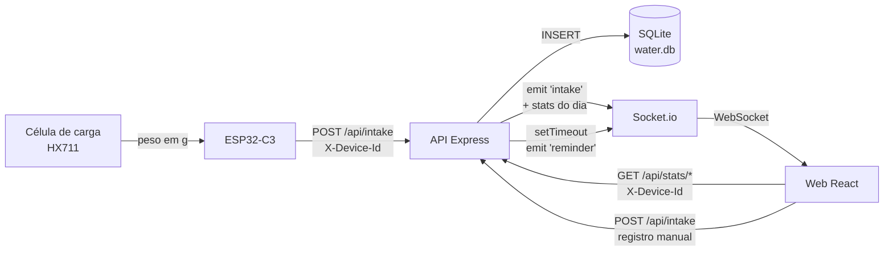
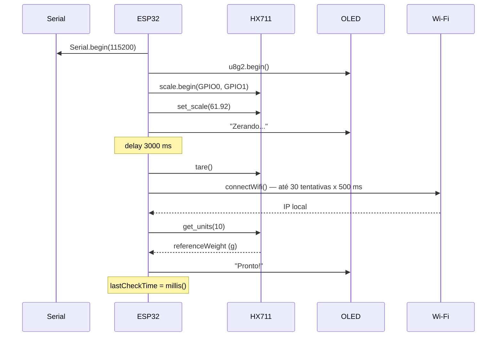
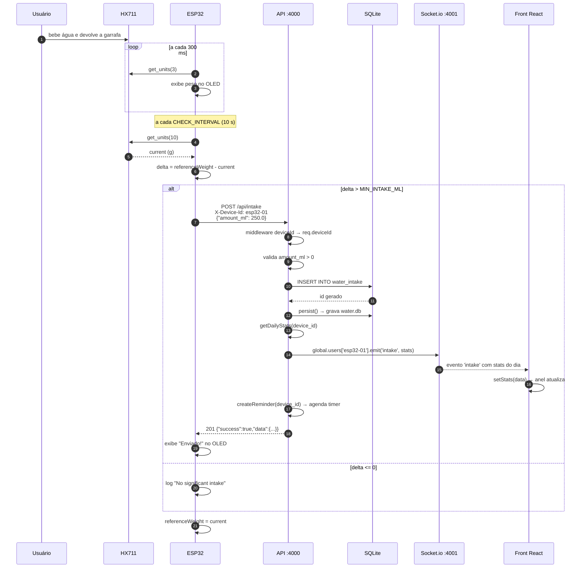
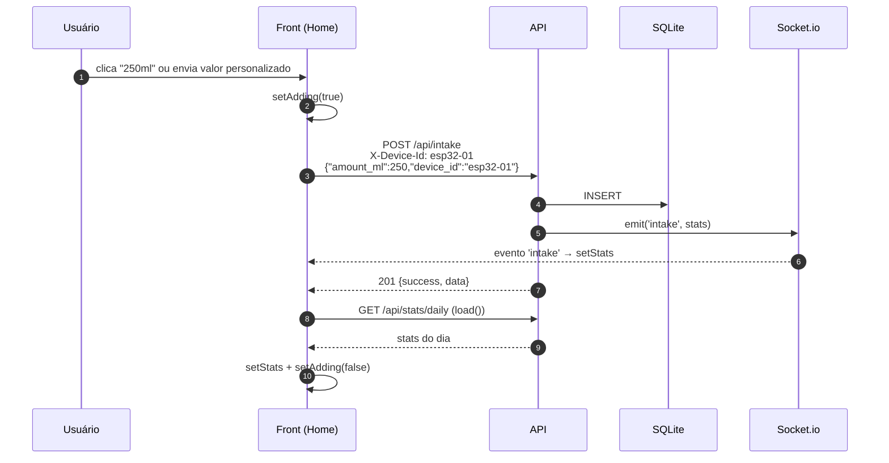
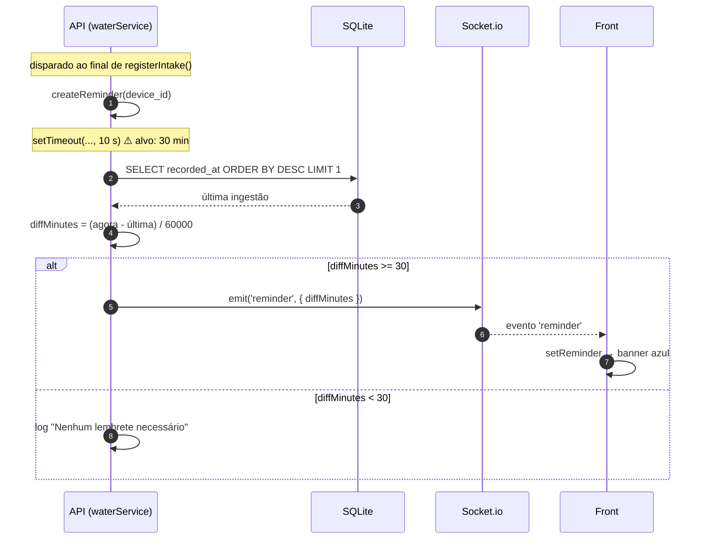
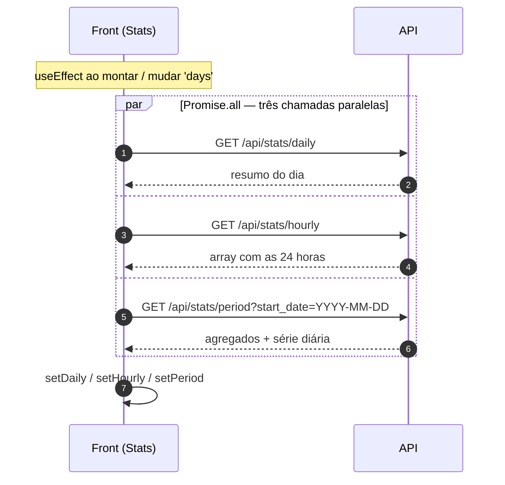
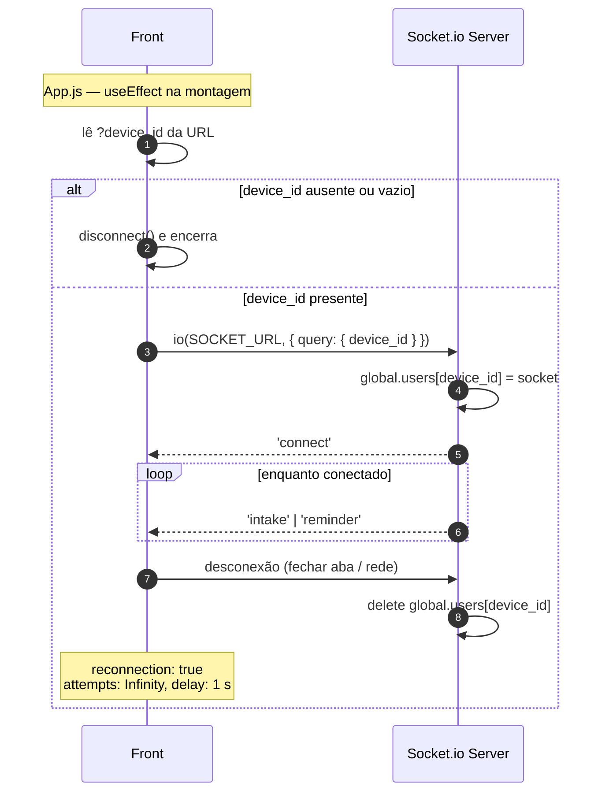

# Water Intake — WI

Sistema completo de monitoramento de hidratação que combina **hardware, backend e frontend** para registrar automaticamente a quantidade de água consumida ao longo do dia.

Uma célula de carga posicionada sob a garrafa detecta a variação de peso, o ESP32 processa os dados e envia as informações via Wi-Fi para uma API, e o usuário acompanha o progresso em tempo real por um aplicativo.

---

## Sumário

**Parte I — Concepção**

1. [Introdução](#1-introdução)
2. [Componentes utilizados](#2-componentes-utilizados)

**Parte II — Arquitetura e integração**

3. [Visão geral do sistema](#3-visão-geral-do-sistema)
4. [Conceito central: o `device_id`](#4-conceito-central-o-device_id)
5. [Fluxo de dados ESP32 → API → Front](#5-fluxo-de-dados-esp32--api--front)

**Parte III — Referência técnica**

6. [Funcionalidades por módulo](#6-funcionalidades-por-módulo)
7. [Referência da API REST](#7-referência-da-api-rest)
8. [Referência dos eventos WebSocket](#8-referência-dos-eventos-websocket)
9. [Modelo de dados](#9-modelo-de-dados)
10. [Configuração e execução](#10-configuração-e-execução)
11. [Matriz de rastreabilidade](#11-matriz-de-rastreabilidade)

**Parte IV — Evolução**

12. [Próximos passos](#12-próximos-passos)

---

# Parte I — Concepção

## 1. Introdução

O WI (nome provisório) é um sistema completo de monitoramento de hidratação que combina hardware, backend e frontend para registrar automaticamente a quantidade de água consumida ao longo do dia.

Uma célula de carga posicionada sob a garrafa de água detecta a variação de peso e o ESP32 processa os dados e envia as informações via Wi-Fi para uma API e o usuário acompanha o progresso em tempo real por um aplicativo.

### 1.1 Motivação

A ideia partiu de uma motivação pessoal de desenvolvimento de algum dispositivo de wellness ou de segurança pessoal para uso próprio. Antes da ideia final, algumas possibilidades foram levantadas:

1. **Sensor de porta** que envia notificação quando a porta for aberta, gerando alertas urgentes em horários críticos → descartada por pesquisa de mercado, onde foram encontrados diversos dispositivos semelhantes e com integrações mais completas (como Alexa e Google Home). Foi recomendado pelo professor a realização de uma pesquisa sobre a área da domótica, que, em uma validação do mercado, foi possível identificar que não haveria muito espaço para "ideias inovadoras" de baixo custo.
2. **Medidor e regulador de stress** → descartada por conta da complexidade de desenvolvimento e calibração do dispositivo wearable dentro do tempo da disciplina. Também foi conferido que alguns smartwatches já possuem funcionalidades parecidas integradas.
3. **Botão de emergência para carro** que envia localização para contatos de emergência → descartada em uma conversa com um Uber que já possuía um dispositivo com propósito parecido e bem mais completo em termos de funcionalidade.

### 1.2 Concepção da ideia

Após o insucesso das ideias anteriores, surgiu a ideia de um dispositivo que acompanha a ingestão de água, também por conta de uma motivação pessoal e insatisfação com os aplicativos existentes para esse fim, onde é necessário cadastrar manualmente a quantidade de água ingerida, gerando dificuldades de aderência ao uso.

O dispositivo desenvolvido ficaria acoplado à base da garrafa para acompanhamento da ingestão através da variação de peso para baixo, com a geração de lembretes para ingestão e envio de estatísticas a um aplicativo.

Em pesquisa de mercado foram encontradas garrafas inteiras com esse mecanismo a preço bastante elevado, e o [Ulla](https://www.ulla.io), um gadget simples que detecta o movimento da garrafa para criar alertas e não se conecta com nenhum sistema. A proposta do dispositivo a ser desenvolvido, então, se diferencia ao possibilitar o acoplamento a qualquer garrafa através de uma base removível, além da integração com o aplicativo.


**A premissa física** é simples: se a garrafa ficou mais leve entre duas medições, a diferença corresponde ao volume ingerido — para água, 1 g ≈ 1 ml. Toda a inteligência do sistema é construída sobre essa relação.

---

## 2. Componentes utilizados


### 2.1 Dispositivo

* Placa microcontroladora ESP32-C3 Super Mini OLED Display de 0.42''
* 4 Jumpers Macho-Macho
* Célula de carga com capacidade para até 50 kg
* Placa HX-711

**Conexões:**

| HX711 | ESP32-C3 |
|-------|----------|
| VCC   | 3V       |
| GND   | GD       |
| DT    | GPIO 0   |
| SCK   | GPIO 1   |

| Célula de carga | HX711 |
|-----------------|-------|
| Vermelho        | E+    |
| Preto           | E−    |
| Branco          | A+    |


**Pinagem efetiva no firmware** (`esp32/esp32.ino`):

| Função | Pino | Constante |
|--------|------|-----------|
| HX711 DT (DOUT) | GPIO 0 | `PIN_DOUT` |
| HX711 SCK | GPIO 1 | `PIN_SCK` |
| OLED SDA | GPIO 5 | `OLED_SDA` |
| OLED SCL | GPIO 6 | `OLED_SCL` |

O display físico é de 72×40 px dentro de um controlador SSD1306 de 128×64, daí os deslocamentos `xOffset = 30` e `yOffset = 12` aplicados em `showDisplay()`.

### 2.2 Materiais complementares

* Protoboard (para testes iniciais)
* Kit de Ferro de Solda 60W com Estanho
* Base de silicone de garrafa para acoplamento final

---

# Parte II — Arquitetura e integração

## 3. Visão geral do sistema

```
        ┌─────────────────────────┐
        │   Garrafa do usuário    │
        └───────────┬─────────────┘
                    │ peso
        ┌───────────▼─────────────┐
        │  Célula de carga 50 kg  │
        │        + HX711          │
        └───────────┬─────────────┘
                    │ DT/SCK (GPIO 0/1)
        ┌───────────▼─────────────┐
        │  ESP32-C3 Super Mini    │   display OLED 0.42"
        │      esp32/esp32.ino       │   mostra peso + device_id
        └───────────┬─────────────┘
                    │ HTTP POST (Wi-Fi)
        ┌───────────▼─────────────┐
        │   API Node.js/Express   │◄──── REST (GET stats, POST intake)
        │   SQLite via sql.js     │
        │   :4000 HTTP            │
        │   :4001 Socket.io       │────► WebSocket (intake, reminder)
        └───────────┬─────────────┘
                    │
        ┌───────────▼─────────────┐
        │  Web React 18           │
        │  ?device_id=esp32-01    │
        └─────────────────────────┘
```

| Camada | Diretório | Stack | Responsabilidade |
|--------|-----------|-------|------------------|
| **Dispositivo** | `esp32/` | C++ (Arduino), HX711, U8g2, WiFi, HTTPClient | Ler o peso, detectar quedas, converter em ml e enviar à API |
| **API** | `api/` | Node.js, Express 4, sql.js (SQLite/WASM), Socket.io 4 | Persistir registros, calcular estatísticas, agendar lembretes e distribuir eventos em tempo real |
| **Web** | `web/` | React 18, CSS puro, socket.io-client | Exibir progresso e estatísticas, permitir registro manual e receber atualizações em tempo real |

A API é o **único ponto de integração**: o ESP32 nunca fala com o front diretamente, e o front nunca fala com o ESP32. Toda comunicação é mediada pelo backend, que atua como broker entre os dois mundos.

---

## 4. Conceito central: o `device_id`

O `device_id` é a chave que costura os três módulos. É uma string livre (no firmware atual, `"esp32-01"`) que identifica um conjunto *dispositivo + usuário*.

Onde ele aparece:

| Contexto | Forma | Arquivo |
|----------|-------|---------|
| Firmware | constante `DEVICE_ID` | `esp32/esp32.ino` |
| Display OLED | terceira linha da tela | `esp32/esp32.ino` → `showDisplay()` |
| Requisição do ESP32 | header `X-Device-Id` | `esp32/esp32.ino` → `sendIntake()` |
| Middleware da API | `req.deviceId` (obrigatório) | `api/src/middleware/index.js` |
| Banco de dados | coluna `device_id` em `water_intake` e `config` | `api/src/models/db.js` |
| Registro do socket | `handshake.query.device_id` → `global.users[deviceId]` | `api/src/server/ws.js` |
| URL do front | query string `?device_id=esp32-01` | `web/src/App.js` |
| Requisições do front | header `X-Device-Id` | `web/src/services/api.js` |

**O fluxo de associação é manual e visual:** o ESP32 imprime seu `DEVICE_ID` no display OLED, e o usuário abre a aplicação web informando esse mesmo id na URL. A partir daí, ambos operam sobre o mesmo conjunto de dados.

Todas as rotas sob `/api` exigem o header `X-Device-Id`. Sem ele, a API responde **400** antes de chegar ao controller:

```js
function deviceId(req, res, next) {
  const id = req.get('X-Device-Id');
  if (!id || !id.trim()) {
    return res.status(400).json({ error: 'Header X-Device-Id é obrigatório.' });
  }
  req.deviceId = id.trim();
  next();
}
```

Consequência prática: **todos os dados são escopados por dispositivo**. Registros, meta diária e estatísticas de um `device_id` são invisíveis para outro.

---

## 5. Fluxo de dados ESP32 → API → Front

Esta é a seção central da documentação. Cada fluxo é descrito com o payload exato em cada salto.

### 5.1 Visão macro



### 5.2 Fluxo 1 — Boot e calibração do dispositivo

Executado uma vez, em `setup()` (`esp32/esp32.ino`).



**Detalhes que importam:**

- `set_scale(CALIBRATION_FACTOR)` com `CALIBRATION_FACTOR = 61.92` converte a leitura bruta do ADC em gramas. Esse valor é específico da célula usada e precisa ser refeito se o hardware mudar.
- O `tare()` zera **o que estiver sobre a base naquele instante**. Logo, o peso de referência inicial (`referenceWeight`) é lido depois da conexão Wi-Fi — janela em que a garrafa deve ser posicionada.
- `connectWifi()` bloqueia por até **15 segundos**. Se falhar, o boot continua mesmo assim, exibindo `"WiFi FALHOU"`; a reconexão é tentada novamente a cada envio.
- Leituras negativas são sempre saturadas em zero (`if (x < 0) x = 0;`).

### 5.3 Fluxo 2 — Detecção e registro automático de ingestão

O caminho completo, do gole ao pixel na tela. **Este é o fluxo principal do sistema.**



**Payload em cada salto:**

**① ESP32 → API** — `esp32/esp32.ino`, função `sendIntake()`

```http
POST /api/intake HTTP/1.1
Host: 192.168.15.193:4000
Content-Type: application/json
X-Device-Id: esp32-01

{"amount_ml":250.0}
```

O corpo é montado com `snprintf(body, 32, "{\"amount_ml\":%.1f}", ml)` — buffer de 32 bytes, uma casa decimal. Note que **o dispositivo não envia timestamp**: quem carimba a hora é o banco.

**② API → SQLite** — `api/src/services/waterService.js`, função `registerIntake()`

```sql
INSERT INTO water_intake (amount_ml, device_id) VALUES (250.0, 'esp32-01');
-- recorded_at recebe o DEFAULT: strftime('%Y-%m-%dT%H:%M:%SZ','now') → UTC
```

Cada escrita é seguida de `persist()`, que exporta o banco inteiro em memória e reescreve o arquivo `data/water.db` — característica do `sql.js` (SQLite compilado para WebAssembly, sem binding nativo).

**③ API → Front (WebSocket)** — evento `intake`

Logo após a inserção, o serviço emite as estatísticas **já recalculadas** do dia para o socket daquele dispositivo:

```js
global.users[device_id]?.emit('intake', getDailyStats(device_id));
```

Payload do evento:

```json
{
  "date": "2026-07-15",
  "total_records": 8,
  "total_ml": 1750,
  "avg_ml_per_record": 218.75,
  "max_single_ml": 350,
  "min_single_ml": 100,
  "first_intake": "2026-07-15T07:00:00Z",
  "last_intake": "2026-07-15T20:30:00Z",
  "goal_ml": 2000,
  "goal_percent": 87,
  "goal_reached": false,
  "remaining_ml": 250
}
```

O operador `?.` é importante: se o front não estiver conectado, a emissão é silenciosamente ignorada e o registro é gravado do mesmo jeito. **O sistema funciona com o front fechado** — os dados aparecem quando ele abrir.

**④ API → ESP32 (resposta HTTP)**

```json
{
  "success": true,
  "data": {
    "id": 42,
    "amount_ml": 250,
    "recorded_at": "2026-07-15T13:22:07Z",
    "device_id": "esp32-01"
  }
}
```

O firmware só checa o código de status: `201` → mostra `"Enviado!"`; qualquer outro código positivo → `"Erro API"` e imprime o corpo na serial; erro de transporte (código negativo) → `"Erro HTTP"`.

**⑤ Front → tela**

O payload do evento `intake` tem exatamente o mesmo formato do retorno de `GET /api/stats/daily`, o que permite que a página o injete direto no estado, sem transformação:

```js
// web/src/pages/Home.js
useEffect(() => {
  const unsub = onIntake((data) => setStats(data));
  return unsub;
}, []);
```

O anel de progresso (`components/Ring.js`) reage à mudança de `goal_percent`, animando o `strokeDasharray` em 0,4 s e trocando de azul (`#2563eb`) para verde (`#16a34a`) ao atingir 100%.

**Semântica do delta — os quatro casos possíveis:**

| Situação | `current` vs `referenceWeight` | `delta` | Comportamento |
|----------|-------------------------------|---------|---------------|
| Usuário bebeu | menor | positivo | Registra ingestão ✅ |
| Nada mudou | igual | ≈ 0 | Nenhum registro |
| Garrafa reabastecida | maior | negativo | Nenhum registro; referência sobe |
| Garrafa retirada da base | ≈ 0 | = peso total | **Falso positivo** ⚠️ |

Em todos os casos `referenceWeight` é atualizado ao final, de modo que o sistema sempre compara contra a última medição estável.

### 5.4 Fluxo 3 — Registro manual pelo front

Complementa o automático: permite lançar um consumo quando o usuário bebeu fora de casa ou o dispositivo estava desligado.



Dois detalhes do cliente REST (`web/src/services/api.js`):

- Em métodos `POST`/`PUT`/`PATCH` o cliente injeta `device_id` **também no corpo**, além do header. A API ignora o campo do corpo e usa exclusivamente `req.deviceId` vindo do header — a duplicação é inofensiva mas redundante.
- Após o `POST`, a página chama `load()` e refaz o `GET /api/stats/daily`. Como a API também emitiu `intake` via socket, a tela acaba sendo atualizada duas vezes com o mesmo conteúdo. Não causa erro visível, apenas uma requisição extra.

Os botões de atalho são `[150, 200, 250, 350, 500]` ml, definidos na constante `QUICK` de `Home.js`, mais um campo numérico livre validado no cliente (`ml > 0`).

### 5.5 Fluxo 4 — Lembrete de hidratação

O único fluxo iniciado pelo servidor, sem requisição do cliente.



Quando o evento chega, as páginas exibem o alert:

> Atenção! Já faz *N* minutos desde sua última ingestão de água. Hora de se hidratar!

**Duas características estruturais deste fluxo:**

1. O lembrete só é **agendado dentro de `registerIntake()`**. Isso significa que o gatilho é sempre uma ingestão anterior — um usuário que nunca bebeu (ou que passou o dia inteiro sem registrar) nunca recebe lembrete algum.
2. O timer está em **10 segundos** no código atual (`1000 * 10`), enquanto a condição de disparo exige **30 minutos** sem beber. Como o timer é verificado 10 s depois da ingestão que acabou de acontecer, `diffMinutes` vale 0 e a condição nunca é satisfeita. Para o lembrete funcionar como projetado, o timeout precisa ser `1000 * 60 * 30`. O comentário no código (`// talvezzz faça sentido que a pessoa personalize os alertas. fica 30min por enquanto`) confirma que 30 min é a intenção e 10 s é resquício de teste.

### 5.6 Fluxo 5 — Carregamento das estatísticas

Executado na montagem das páginas e a cada troca de período.



A página **Estatísticas** dispara as três requisições em paralelo com `Promise.all`, o que mantém o tempo de carga próximo ao da chamada mais lenta. O seletor de período (7 / 14 / 30 dias) recalcula `start_date` no cliente via `dateNDaysAgo(n)` e deixa `end_date` a cargo do servidor (padrão: hoje).

### 5.7 Ciclo de vida da conexão WebSocket



O servidor mantém um mapa simples `device_id → socket` em `global.users`. O cliente reconecta indefinidamente a cada 1 s em caso de queda, e o `connectDevice()` é idempotente: chamado novamente com o mesmo id, devolve o socket existente em vez de abrir outro.

O registro de listeners usa `Set` com função de cancelamento, permitindo que os `useEffect` do React limpem corretamente na desmontagem:

```js
export function onIntake(cb) {
  intakeListeners.add(cb);
  return () => intakeListeners.delete(cb);   // usado como cleanup do useEffect
}
```

### 5.8 Tabela consolidada de contratos

| # | Origem → Destino | Protocolo | Identificação | Payload |
|---|------------------|-----------|---------------|---------|
| 1 | ESP32 → API | HTTP POST | header `X-Device-Id` | `{"amount_ml": <float>}` |
| 2 | API → ESP32 | HTTP 201 | — | `{success, data:{id, amount_ml, recorded_at, device_id}}` |
| 3 | API → SQLite | SQL | coluna `device_id` | `INSERT INTO water_intake` |
| 4 | API → Front | WS `intake` | `global.users[device_id]` | objeto de estatísticas diárias |
| 5 | API → Front | WS `reminder` | `global.users[device_id]` | `{diffMinutes: <int>}` |
| 6 | Front → API | HTTP GET/POST/DELETE | header `X-Device-Id` | conforme endpoint |
| 7 | Front → WS | handshake | `query.device_id` | — |

---

# Parte III — Referência técnica

## 6. Funcionalidades por módulo

As medições de peso realizadas na garrafa são enviadas para um aplicativo, com o objetivo de apresentar ao usuário estatísticas de ingestão de água, diárias e por período selecionado, e permitir a configuração do tamanho da garrafa utilizada e da meta diária de ingestão.

### 6.1 Dispositivo (`esp32/esp32.ino`)

| Funcionalidade | Descrição | Status |
|----------------|-----------|--------|
| Leitura de peso | Célula de 50 kg + HX711, fator de calibração 61.92, saturação de negativos em zero | ✅ |
| Detecção de ingestão | Comparação de peso a cada 10 s; delta positivo vira ingestão | ✅ |
| Exibição no OLED | Peso ao vivo (atualizado a cada ~300 ms), marca "WI!" e `DEVICE_ID` | ✅ |
| Conexão Wi-Fi | Até 30 tentativas no boot; reconexão automática antes de cada envio | ✅ |
| Envio à API | `HTTPClient` POST com JSON e header de identificação | ✅ |
| Feedback visual | "Zerando..." / "WiFi OK" / "Registrado" / "Enviado!" / "Erro API" / "Erro HTTP" | ✅ |

**Parâmetros ajustáveis:**

| Constante | Valor atual | Efeito |
|-----------|-------------|--------|
| `WIFI_SSID` / `WIFI_PASSWORD` | fixos no código | Rede à qual o dispositivo se conecta |
| `API_URL` | `http://192.168.15.193:4000/api/intake` | Endpoint de destino (IP da máquina na LAN) |
| `DEVICE_ID` | `esp32-01` | Identidade do dispositivo |
| `CALIBRATION_FACTOR` | `61.92` | Conversão ADC → gramas |
| `CHECK_INTERVAL` | `10000` ms | Frequência de verificação de ingestão |
| `MIN_INTAKE_ML` | `0` | Limiar mínimo para considerar ingestão |

### 6.2 API (`api/`)

Backend em Node.js responsável por armazenar e processar os dados de consumo.

**Stack:** Node.js · Express 4 · sql.js (SQLite/WASM) · Socket.io 4 · dotenv · cors

| Funcionalidade | Endpoint / mecanismo | Status |
|----------------|---------------------|--------|
| Healthcheck | `GET /health` | ✅ |
| Registro de ingestão | `POST /api/intake` | ✅ |
| Listagem com filtros | `GET /api/intake?date&limit&offset` | ✅ |
| Remoção de registro | `DELETE /api/intake/:id` | ✅ |
| Consulta de meta | `GET /api/goal` | ✅ |
| Atualização de meta | `PUT /api/goal` | ✅ |
| Estatísticas do dia | `GET /api/stats/daily` | ✅ |
| Estatísticas por período | `GET /api/stats/period` | ✅ |
| Distribuição horária | `GET /api/stats/hourly` | ✅ |
| Push de ingestão | evento WS `intake` | ✅ |
| Push de lembrete | evento WS `reminder` | ⚠️ implementado, timer em modo teste |
| Configuração de tamanho da garrafa | — | ❌ não implementado |
| Autenticação | — | ❌ não implementado |

**Estrutura de pastas:**

```
api/src/
├── index.js                       # Entry point: initDb() → http.run() + ws.run()
├── server/
│   ├── http.js                    # Express: CORS, JSON, logger, /health, /api
│   └── ws.js                      # Socket.io: mapa global.users[device_id]
├── routes/water.js                # Definição das 8 rotas de /api
├── controllers/waterController.js # Validação de entrada e códigos HTTP
├── services/waterService.js       # Regras de negócio, SQL e lembretes
├── models/db.js                   # Schema, migrações idempotentes e persistência
└── middleware/index.js            # deviceId, requestLogger, errorHandler, notFound
```

**Separação de responsabilidades:** o controller cuida exclusivamente de validar entrada e traduzir resultados em códigos HTTP; o service concentra SQL, cálculo de estatísticas e efeitos colaterais (emissão de eventos, agendamento de lembretes); o model isola inicialização, schema e persistência do SQLite.

**Resolução da meta diária em cascata** (`getDailyGoal`):

```
1. meta do próprio device_id          → source: "device"
2. meta do device 'default'           → source: "default"
3. variável de ambiente DAILY_GOAL_ML → source: "fallback"
```

A consulta faz isso em um único SQL, ordenando por `CASE device_id WHEN ? THEN 0 ELSE 1 END` e limitando a uma linha. O campo `source` na resposta informa qual nível foi usado.

**Middlewares** (`middleware/index.js`):

| Middleware | Função |
|------------|--------|
| `deviceId` | Exige `X-Device-Id`, popula `req.deviceId`, responde 400 se ausente |
| `requestLogger` | Loga método, URL, status e duração ao final de cada resposta |
| `errorHandler` | Captura exceções não tratadas → 500 com `detail` |
| `notFound` | Rotas inexistentes → 404 com método e URL |

### 6.3 Aplicação Web (`web/`)

Frontend em React para acompanhamento do consumo e configuração pelo usuário.

**Stack:** React 18 + CSS puro (sem dependências de UI) + socket.io-client

> Inicialmente foi montado um projeto básico utilizando React Native Expo, porém, por limitações de inicialização (VPNs), foi realizada a substituição para ReactJS na Web.

| Funcionalidade | Local | Status |
|----------------|-------|--------|
| Anel de progresso diário | `Home.js` + `Ring.js` | ✅ |
| Cartões de meta / restante / registros | `Home.js` | ✅ |
| Registro rápido (150–500 ml) | `Home.js` | ✅ |
| Registro personalizado | `Home.js` | ✅ |
| Banner de lembrete | `Home.js`, `Stats.js` | ✅ |
| Gráfico de consumo por hora | `Stats.js` | ✅ |
| Seletor de período 7/14/30 dias | `Stats.js` | ✅ |
| Agregados do período | `Stats.js` | ✅ |
| Detalhamento dia a dia | `Stats.js` | ✅ |
| Atualização em tempo real | `services/socket.js` | ✅ |

**Estrutura de pastas:**

```
web/
├── public/index.html
└── src/
    ├── App.js                  # Navegação por abas (Início / Estatísticas)
    ├── index.js / index.css    # Bootstrap e estilos
    ├── pages/
    │   ├── Home.js             # Anel de progresso + registro manual
    │   └── Stats.js            # Gráfico por hora + histórico por período
    ├── components/Ring.js      # Anel de progresso em SVG
    └── services/
        ├── api.js              # Cliente REST (injeta X-Device-Id)
        └── socket.js           # Cliente Socket.io (eventos intake/reminder)
```

**Navegação** (`App.js`): duas abas — `Início` e `Estatísticas` — controladas por estado local (`useState`), sem router. A conexão do socket é aberta uma única vez na montagem do `App`.

**Tela Início:**

- Data por extenso em pt-BR (`weekday, day, month`).
- Anel SVG exibindo ml consumidos, rótulo e percentual no centro.
- Três cartões: meta do dia, quanto falta (ou "Atingida!" com destaque verde) e número de registros.

**Tela Estatísticas:**

- Barras das 24 horas do dia, com altura proporcional ao máximo e `title` no hover mostrando `Xh: Yml`; rótulos fixos em 00/06/12/18/23 h.
- Horários da primeira e última ingestão formatados em pt-BR.
- Três agregados: total no período em litros, média diária em ml e razão `metas atingidas / dias com dados`.
- Lista diária em ordem cronológica inversa, com barra de progresso por dia (verde quando a meta foi batida).

**Design system** (`index.css`): variáveis CSS em `:root` — `--accent: #2563eb`, `--success: #16a34a`, `--danger: #dc2626`, `--text: #111827`, `--sub: #6b7280`, `--radius: 10px`, entre outras. Sem dependência de biblioteca de UI.

---

## 7. Referência da API REST

Base: `http://<host>:4000`. Todas as rotas sob `/api` exigem o header `X-Device-Id`.

| Método | Rota | Descrição |
|--------|------|-----------|
| `GET` | `/health` | Healthcheck (não exige header) |
| `POST` | `/api/intake` | Registra consumo (usado pelo ESP32) |
| `GET` | `/api/intake` | Lista registros com filtros |
| `DELETE` | `/api/intake/:id` | Remove um registro |
| `GET` | `/api/goal` | Retorna a meta diária |
| `PUT` | `/api/goal` | Atualiza a meta diária |
| `GET` | `/api/stats/daily` | Estatísticas do dia |
| `GET` | `/api/stats/period` | Histórico por período |
| `GET` | `/api/stats/hourly` | Distribuição por hora |

### `GET /health`

Sem autenticação. Verifica se o processo está no ar.

```json
{ "status": "ok", "timestamp": "2026-07-15T13:20:00.000Z" }
```

### `POST /api/intake`

Registra uma ingestão. Usado pelo ESP32 e pelo registro manual da web.

**Corpo:** `{ "amount_ml": 250 }`

| Validação | Resposta |
|-----------|----------|
| `amount_ml` ausente/nulo | 400 — `O campo amount_ml é obrigatório.` |
| `amount_ml` não numérico ou ≤ 0 | 400 — `amount_ml deve ser um número positivo.` |
| Sucesso | 201 — `{success:true, data:{id, amount_ml, recorded_at, device_id}}` |

**Efeitos colaterais:** emite o evento `intake` e agenda um lembrete.

### `GET /api/intake`

| Query | Padrão | Descrição |
|-------|--------|-----------|
| `date` | — | Filtra por data (`YYYY-MM-DD`) |
| `limit` | `100` | Máximo de registros |
| `offset` | `0` | Deslocamento para paginação |

Retorna `{success, count, data:[...]}` ordenado por `recorded_at DESC`.

### `DELETE /api/intake/:id`

Remove um registro **do próprio dispositivo**. Retorna 400 para id não numérico, 404 se o registro não existir ou pertencer a outro `device_id`, e 200 com o registro removido em caso de sucesso.

### `GET /api/goal` · `PUT /api/goal`

`GET` retorna `{device_id, daily_goal_ml, updated_at, source}`, onde `source` é `"device"`, `"default"` ou `"fallback"`.

`PUT` recebe `{ "daily_goal_ml": 2500 }`, valida número positivo e grava via `INSERT ... ON CONFLICT(key, device_id) DO UPDATE`, devolvendo a meta já resolvida.

### `GET /api/stats/daily`

Query opcional `date` (padrão: hoje). Campos calculados: `goal_percent` (arredondado e limitado a 100), `goal_reached` (booleano) e `remaining_ml` (nunca negativo). Quando não há registros no dia, retorna a estrutura completa zerada, com `remaining_ml` igual à meta — o que evita tratamento de nulo no front.

### `GET /api/stats/period`

Query `start_date` e `end_date` (padrão: últimos 7 dias até hoje).

```json
{
  "period": { "start_date": "2026-07-09", "end_date": "2026-07-15" },
  "days_with_data": 6,
  "overall_total_ml": 12400,
  "overall_avg_daily_ml": 2066,
  "overall_total_records": 48,
  "daily": [
    { "date": "2026-07-09", "total_records": 7, "total_ml": 1900,
      "avg_ml_per_record": 271.4, "goal_ml": 2000,
      "goal_percent": 95, "goal_reached": false }
  ]
}
```

`overall_avg_daily_ml` divide pelo número de **dias com dados**, não pelo tamanho do intervalo — dias sem nenhum registro não puxam a média para baixo.

### `GET /api/stats/hourly`

Retorna sempre as **24 horas**, preenchendo com zero as que não têm registro — o front pode iterar direto sem normalizar:

```json
{ "date": "2026-07-15",
  "hourly": [ { "hour": 0, "records": 0, "total_ml": 0 }, ... ] }
```

---

## 8. Referência dos eventos WebSocket

Servidor Socket.io na porta `WS_PORT` (padrão 4001).

**Handshake:** `io(SOCKET_URL, { query: { device_id: 'esp32-01' } })`

| Evento | Direção | Payload | Gatilho |
|--------|---------|---------|---------|
| `connect` | servidor → cliente | — | Conexão estabelecida |
| `disconnect` | servidor → cliente | — | Queda ou fechamento |
| `connect_error` | servidor → cliente | `Error` | Falha ao conectar |
| `intake` | servidor → cliente | objeto de estatísticas diárias | Toda vez que uma ingestão é registrada |
| `reminder` | servidor → cliente | `{ diffMinutes: number }` | Timer pós-ingestão, se ≥ 30 min sem beber |

O front expõe dois registradores com cancelamento (`onIntake`, `onReminder`), consumidos pelas duas páginas.

---

## 9. Modelo de dados

Banco SQLite gerado automaticamente em `data/water.db` (configurável por `DB_PATH`), manipulado via `sql.js`.

```sql
CREATE TABLE water_intake (
  id          INTEGER PRIMARY KEY AUTOINCREMENT,
  amount_ml   REAL    NOT NULL CHECK (amount_ml > 0),
  recorded_at TEXT    NOT NULL DEFAULT (strftime('%Y-%m-%dT%H:%M:%SZ','now')),
  device_id   TEXT    NOT NULL DEFAULT 'arduino-01'
);
CREATE INDEX idx_recorded_at ON water_intake (recorded_at);
CREATE INDEX idx_device_id   ON water_intake (device_id);

CREATE TABLE config (
  key        TEXT NOT NULL,
  device_id  TEXT NOT NULL DEFAULT 'default',
  value      TEXT NOT NULL,
  updated_at TEXT NOT NULL DEFAULT (strftime('%Y-%m-%dT%H:%M:%SZ','now')),
  PRIMARY KEY (key, device_id)
);
```

A tabela `config` é um dicionário chave-valor por dispositivo. Hoje guarda apenas `daily_goal_ml`, mas o formato comporta novas configurações (tamanho da garrafa, intervalo de lembrete) sem alteração de schema.

**Migrações idempotentes** (`models/db.js`), aplicadas a cada boot em bancos preexistentes:

1. **Remoção da coluna `notes`** de `water_intake` — como versões antigas do SQLite não suportam `DROP COLUMN`, o código recria a tabela, copia os dados com `COALESCE(device_id,'arduino-01')`, remove a original e renomeia.
2. **Inclusão de `device_id` em `config`** — recria a tabela com chave primária composta e migra a meta global antiga para o dispositivo `'default'`.

Ambas são guardadas por `columnExists()`, então rodar várias vezes é seguro. Bancos novos já nascem no formato final e não passam por migração.

A meta padrão é semeada com `INSERT OR IGNORE`, preservando qualquer valor já configurado.

---

## 10. Configuração e execução

### Ordem de inicialização

```
1. API      → npm start   (HTTP :4000 + WebSocket :4001)
2. Web      → npm start   (:3000, abrir com ?device_id=...)
3. ESP32    → gravar sketch com API_URL apontando para o IP da máquina da API
```

Todos os três módulos precisam estar na **mesma rede local** — não há exposição pública nem túnel configurado.

### API

```bash
cd api
npm install
cp .env.example .env
npm start        # sobe HTTP e WebSocket
npm run fresh    # apaga data/water.db e reinicia do zero
```

| Variável | Padrão | Descrição |
|----------|--------|-----------|
| `PORT` | `4000` | Porta do servidor HTTP |
| `WS_PORT` | `4001` | Porta do Socket.io |
| `DAILY_GOAL_ML` | `2000` | Meta padrão (fallback) |
| `DB_PATH` | `./data/water.db` | Caminho do arquivo SQLite |

### Web

```bash
cd web
npm install
cp .env.example .env
npm start
# abrir http://localhost:3000/?device_id=esp32-01
```

| Variável | Padrão | Descrição |
|----------|--------|-----------|
| `REACT_APP_API_URL` | `http://localhost:4000/api` | Base da API REST |
| `REACT_APP_SOCKET_URL` | `http://localhost:4001` | Servidor Socket.io |

> **Importante:** `REACT_APP_SOCKET_URL` é obrigatório na prática. Sem ele, o cliente deriva a URL removendo o sufixo `/api` da base REST, chegando a `http://localhost:4000` — porta do HTTP, não do WebSocket, que roda em 4001. Copiar o `.env.example` já resolve.

### ESP32

1. Instalar as bibliotecas `HX711`, `U8g2` e o core ESP32 na IDE Arduino.
2. Ajustar `WIFI_SSID`, `WIFI_PASSWORD` e `API_URL` (IP da máquina que roda a API na mesma rede local).
3. Calibrar `CALIBRATION_FACTOR` para a célula em uso.
4. Gravar e acompanhar pela serial em 115200 baud.
5. Ligar com a base **vazia** e posicionar a garrafa durante a conexão Wi-Fi (ver [seção 12](#12-pontos-de-atenção-e-limitações-conhecidas), item 2).

---

## 11. Matriz de rastreabilidade

| Funcionalidade | Dispositivo | API | Web |
|----------------|-------------|-----|-----|
| Detecção automática de ingestão | `esp32.ino` → `loop()` | `POST /api/intake` | evento `intake` |
| Registro manual | — | `POST /api/intake` | `Home.js` → `add()` |
| Progresso do dia | — | `services/waterService.js` → `getDailyStats()` | `Home.js` + `Ring.js` |
| Consumo por hora | — | `getHourlyDistribution()` | `Stats.js` → `chart-bars` |
| Histórico por período | — | `getPeriodStats()` | `Stats.js` → `day-row` |
| Meta diária | — | `getDailyGoal()` / `setDailyGoal()` | somente leitura via stats |
| Lembretes | — | `createReminder()` + `ws.js` | banner em `Home`/`Stats` |
| Identificação | `DEVICE_ID` no OLED | middleware `deviceId` | `?device_id=` na URL |

---

## 12. Próximos passos

**Concluído**

- [x] Desenvolvimento da interface do front-end
- [x] Desenvolver algoritmos de medição da variação de peso da garrafa e envio de lembretes para API
- [x] Soldar componentes
- [x] Criar servidor de socket.io na API para envio de lembretes ao front-end
- [x] Imprimir id do dispositivo no display para associação no front-end
- [x] Adicionar maior detalhamento da integração dispositivo-API-frontend na documentação
- [x] Consertar erros de integração entre o ESP32 e HX711
- [x] Acoplar dispositivo à base de silicone da garrafa

**Pendente**

- [ ] Criar endpoints na API para definição e retorno do tamanho da garrafa
- [ ] Definir formato de "alimentação móvel" (baterias ou powerbanks)

**Melhorias identificadas na análise do código**

- [ ] Restaurar o timer de lembrete para 30 min e torná-lo configurável por usuário
- [ ] Tela de configurações na web (meta diária, já suportada pela API)
- [ ] Atualizar `api/README.md` e `web/README.md`, hoje divergentes do código

> Possivelmente existem passos intermediários que serão melhor elaborados conforme o avanço do desenvolvimento.
