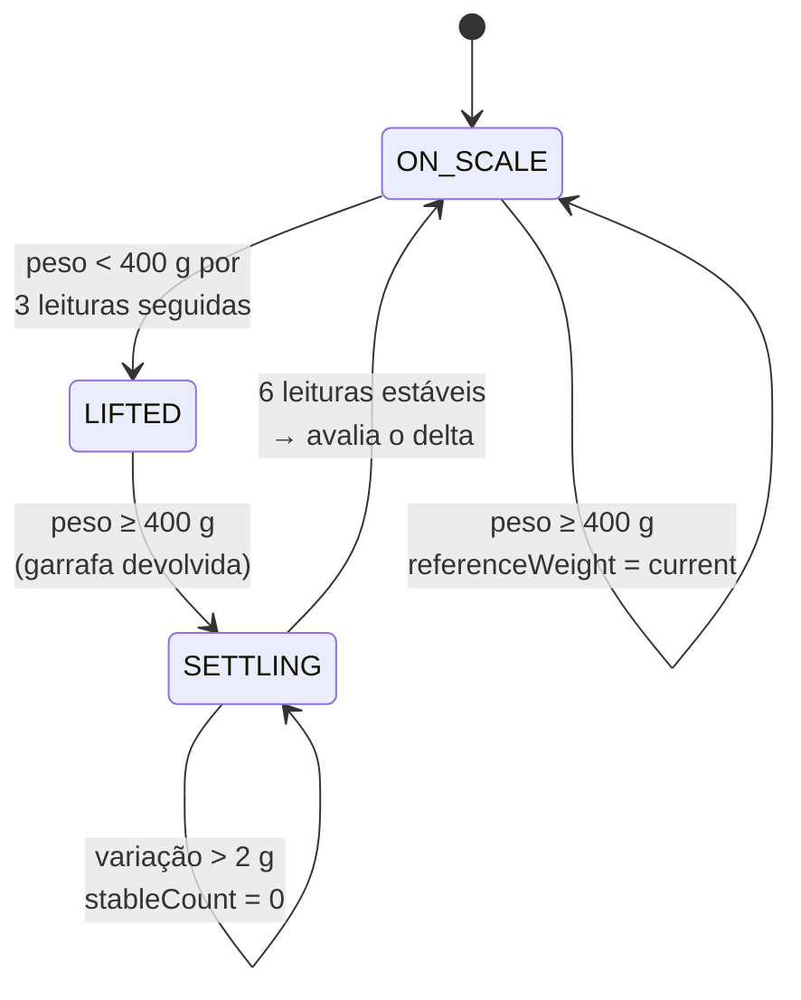
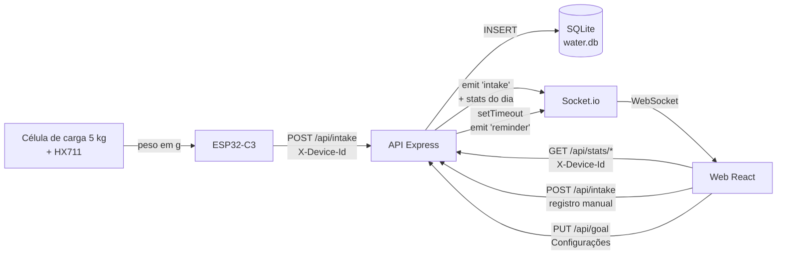

# Water Intake — WI

Sistema completo de monitoramento de hidratação que combina **hardware, backend e frontend** para registrar automaticamente a quantidade de água consumida ao longo do dia.

Uma célula de carga posicionada sob a garrafa detecta a variação de peso, o ESP32 processa os dados e envia as informações via Wi-Fi para uma API, e o usuário acompanha o progresso em tempo real por um aplicativo web.

---

# Parte I — Concepção e dispositivo

## 1. Introdução

O WI (nome provisório) é um sistema completo de monitoramento de hidratação que combina hardware, backend e frontend para registrar automaticamente a quantidade de água consumida ao longo do dia.

Uma célula de carga posicionada sob a garrafa de água detecta a variação de peso, o ESP32 processa os dados e envia as informações via Wi-Fi para uma API, e o usuário acompanha o progresso em tempo real por um aplicativo.

### 1.1 Motivação

A ideia partiu de uma motivação pessoal de desenvolvimento de algum dispositivo de wellness ou de segurança pessoal para uso próprio. Antes da ideia final, algumas possibilidades foram levantadas:

1. **Sensor de porta** que envia notificação quando a porta for aberta, gerando alertas urgentes em horários críticos → descartada por pesquisa de mercado, onde foram encontrados diversos dispositivos semelhantes e com integrações mais completas (como Alexa e Google Home). Foi recomendado pelo professor a realização de uma pesquisa sobre a área da domótica, que, em uma validação do mercado, foi possível identificar que não haveria muito espaço para "ideias inovadoras" de baixo custo.
2. **Medidor e regulador de stress** → descartada por conta da complexidade de desenvolvimento e calibração do dispositivo wearable dentro do tempo da disciplina. Também foi conferido que alguns smartwatches já possuem funcionalidades parecidas integradas.
3. **Botão de emergência para carro** que envia localização para contatos de emergência → descartada em uma conversa com um Uber que já possuía um dispositivo com propósito parecido e bem mais completo em termos de funcionalidade.

### 1.2 Concepção da ideia

Após o insucesso das ideias anteriores, surgiu a ideia de um dispositivo que acompanha a ingestão de água, também por conta de uma motivação pessoal e insatisfação com os aplicativos existentes para esse fim, onde é necessário cadastrar manualmente a quantidade de água ingerida, gerando dificuldades de aderência ao uso.

O dispositivo desenvolvido ficaria acoplado à base da garrafa para acompanhamento da ingestão através da variação de peso para baixo, com a geração de lembretes para ingestão e envio de estatísticas a um aplicativo.

Em pesquisa de mercado foram encontradas garrafas inteiras com esse mecanismo a preço bastante elevado, e o [Ulla](https://www.ulla.io), um gadget simples que detecta o movimento da garrafa para criar alertas e não se conecta com nenhum sistema. A proposta do dispositivo a ser desenvolvido, então, se diferencia ao possibilitar o acoplamento a qualquer garrafa através de uma base removível, além da integração com o aplicativo.


### 1.3 A premissa física

A premissa é simples: se a garrafa ficou mais leve entre duas medições estáveis, a diferença corresponde ao volume ingerido — para água, **1 g ≈ 1 ml**, porque a densidade da água a temperatura ambiente é praticamente 1 g/cm³.

Essa equivalência é o motivo de a conversão nunca aparecer explicitamente no código: o firmware calcula uma diferença **em gramas** e a envia no campo `amount_ml` sem multiplicar por nada. Toda a inteligência do sistema é construída sobre essa relação.

```
delta [g] = referenceWeight - current      →  enviado como amount_ml
```

---

## 2. Componentes utilizados


### 2.1 Dispositivo

| Componente | Especificação | Papel no projeto |
|------------|---------------|------------------|
| Placa microcontroladora | ESP32-C3 Super Mini com display OLED de 0.42'' integrado | Cérebro: lê o HX711, roda a máquina de estados, conecta no Wi-Fi e envia HTTP |
| Célula de carga | Barra de alumínio, capacidade **até 5 kg** | Transdutor: converte força (peso) em desequilíbrio elétrico |
| Placa HX-711 | Amplificador + conversor A/D de 24 bits dedicado a células de carga | Excita a ponte, amplifica os microvolts e digitaliza |
| Jumpers | 4 jumpers **fêmea-fêmea** | Ligação HX711 ↔ ESP32-C3 |

**Conexões HX711 ↔ ESP32-C3** (os 4 jumpers fêmea-fêmea):

| HX711 | ESP32-C3 |
|-------|----------|
| VCC   | 3V       |
| GND   | GND      |
| DT    | GPIO 0   |
| SCK   | GPIO 1   |

**Conexões célula de carga ↔ HX711** (os 4 fios que saem da célula):

| Fio da célula | HX711 | Função |
|---------------|-------|--------|
| Vermelho | E+ | Excitação positiva (alimentação da ponte) |
| Preto    | E− | Excitação negativa (referência da ponte) |
| Branco   | A− | Sinal negativo do canal A |
| Verde    | A+ | Sinal positivo do canal A |

> Inicialmente foi realizada uma tentativa de uso utilizando uma célula de carga de 3 fios, porém essa é uma célula "meia ponte" que necessita de outras em conjunto. A alteração para a célula de 4 fios permitiu o uso de uma célula única para capturar todos os sinais necessários pelo ESP32.


**Pinagem efetiva no firmware** (`esp32/esp32.ino`):

| Função | Pino | Constante |
|--------|------|-----------|
| HX711 DT (DOUT) | GPIO 0 | `PIN_DOUT` |
| HX711 SCK | GPIO 1 | `PIN_SCK` |
| OLED SDA | GPIO 5 | `OLED_SDA` |
| OLED SCL | GPIO 6 | `OLED_SCL` |

O display físico é de 72×40 px dentro de um controlador SSD1306 de 128×64, daí os deslocamentos `xOffset = 30` e `yOffset = 12` aplicados em `showDisplay()`. Sem eles, o texto seria desenhado no canto superior esquerdo do *buffer*, que fica fora da área de vidro visível.

### 2.2 Materiais complementares

* Protoboard (para testes iniciais)
* Kit de Ferro de Solda 60W com Estanho
* Base de silicone de garrafa para acoplamento final

### 2.3 Montagem mecânica

A célula de carga **só mede corretamente se for montada em balanço** (*cantilever*): uma extremidade fixa rigidamente à base e a outra livre, recebendo a carga. A seta gravada no corpo da célula indica o sentido da força.

```
        garrafa
          ↓ ↓ ↓
    ┌───────────────┐  ← plataforma superior (recebe a carga)
    │               │
    ╞═══════════════╡  ← célula de carga: extremidade esquerda parafusada,
    │               │     extremidade direita livre → a barra flexiona
    └───────────────┘  ← base fixa (base de silicone da garrafa)
```

Se as duas extremidades forem parafusadas na mesma superfície rígida, a barra não flexiona, os *strain gauges* não deformam e a leitura fica praticamente constante.

---

# Parte II — Arquitetura e integração

## 4. Visão geral do sistema

```
        ┌─────────────────────────┐
        │   Garrafa do usuário    │
        └───────────┬─────────────┘
                    │ força (peso)
        ┌───────────▼─────────────┐
        │ Célula de carga  5 kg   │   ponte de Wheatstone completa
        │   4 fios → HX711        │   E+/E− excitação, A+/A− sinal
        └───────────┬─────────────┘
                    │ DT/SCK (GPIO 0/1) — protocolo de 2 fios
        ┌───────────▼─────────────┐
        │  ESP32-C3 Super Mini    │   display OLED 0.42"
        │     esp32/esp32.ino     │   mostra peso + "WI!" + device_id
        └───────────┬─────────────┘
                    │ HTTP POST (Wi-Fi)
        ┌───────────▼─────────────┐
        │   API Node.js/Express   │◄──── REST (GET stats, POST intake, PUT goal)
        │   SQLite via sql.js     │
        │   :4000 HTTP            │
        │   :4001 Socket.io       │────► WebSocket (intake, reminder)
        └───────────┬─────────────┘
                    │
        ┌───────────▼─────────────┐
        │  Web React 18           │   3 abas: Início · Estatísticas · Configurações
        │  ?device_id=esp32-01    │
        └─────────────────────────┘
```

| Camada | Diretório | Stack | Responsabilidade |
|--------|-----------|-------|------------------|
| **Dispositivo** | `esp32/` | C++ (Arduino), HX711, U8g2, Wire, WiFi, HTTPClient | Ler o peso, detectar o ciclo pegar-beber-devolver, converter em ml e enviar à API |
| **API** | `api/` | Node.js, Express 4, sql.js (SQLite/WASM), Socket.io 4 | Persistir registros, calcular estatísticas, agendar lembretes e distribuir eventos em tempo real |
| **Web** | `web/` | React 18, CSS puro, socket.io-client | Exibir progresso e estatísticas, permitir registro manual, configurar a meta diária e receber atualizações em tempo real |

A API é o **único ponto de integração**: o ESP32 nunca fala com o front diretamente, e o front nunca fala com o ESP32. Toda comunicação é mediada pelo backend, que atua como *broker* entre os dois mundos.

---

## 5. Conceito central: o `device_id`

O `device_id` é a chave que costura os três módulos. É uma string livre (no firmware atual, `"esp32-01"`) que identifica um conjunto *dispositivo + usuário*.

**O fluxo de associação é manual e visual:** o ESP32 imprime seu `DEVICE_ID` no display OLED, e o usuário abre a aplicação web informando esse mesmo id na URL. A partir daí, ambos operam sobre o mesmo conjunto de dados.

---

## 6. Firmware do ESP32 em detalhe

Arquivo único: `esp32/esp32.ino`, 232 linhas.

### 6.1 Bibliotecas utilizadas

| Biblioteca | Origem | Papel |
|------------|--------|-------|
| `HX711.h` | Bogdan Necula / Andreas Motl | Abstrai o protocolo de dois fios do HX711 (temporização de SCK, leitura dos 24 bits em complemento de dois, pulsos de seleção de ganho) e implementa tara, escala e média móvel |
| `U8g2lib.h` | olikraus | Driver gráfico universal para displays monocromáticos; conhece o SSD1306 e traz as fontes de bitmap |
| `Wire.h` | core Arduino | Barramento I²C de baixo nível usado pela U8g2 para falar com o OLED |
| `WiFi.h` | core ESP32 | Pilha 802.11: associação à rede, DHCP, status da conexão |
| `HTTPClient.h` | core ESP32 | Cliente HTTP sobre TCP: monta a requisição, adiciona headers e devolve o código de status |

As duas primeiras precisam ser instaladas pelo gerenciador de bibliotecas da IDE Arduino; as três últimas vêm com o core do ESP32.

Os três métodos da `HX711` que o projeto realmente usa:

| Chamada | O que faz |
|---------|-----------|
| `scale.begin(PIN_DOUT, PIN_SCK)` | Configura os pinos e inicializa o barramento |
| `scale.set_scale(350)` | Define o divisor contagens→gramas |
| `scale.tare()` | Faz uma média com a base vazia e a guarda como `offset` |
| `scale.get_units(n)` | Lê `n` amostras, tira a média, subtrai o `offset`, divide pela escala e devolve **gramas** |

### 6.2 As constantes de decisão

Todo o comportamento do dispositivo é governado por oito constantes:

| Constante | Valor | Significado |
|-----------|-------|-------------|
| `CALIBRATION_FACTOR` | `350` | Contagens do HX711 por grama |
| `MIN_BOTTLE_WEIGHT` | `400.0` g | Abaixo disso, considera-se que **não há garrafa** sobre a base |
| `MIN_INTAKE_ML` | `50.0` | Diferença mínima para valer como ingestão — filtra ruído e reposicionamento |
| `STABLE_THRESHOLD` | `2.0` g | Tolerância entre leituras consecutivas para considerá-las "iguais" |
| `STABLE_CONFIRM` | `6` | Leituras consecutivas dentro da tolerância para declarar estabilidade |
| `LIFT_CONFIRM` | `3` | Leituras consecutivas abaixo do mínimo para declarar que a garrafa foi retirada |
| `READ_INTERVAL_MS` | `300` | Pausa ao final de cada iteração do `loop()` |
| `DEVICE_ID` | `"esp32-01"` | Identidade do dispositivo |

`STABLE_CONFIRM` e `LIFT_CONFIRM` são **debounce por software**: em vez de confiar em uma única leitura — que pode ser um pico de ruído ou um esbarrão na mesa —, o firmware exige um número de confirmações seguidas.

### 6.3 `setup()` — a sequência de inicialização

```cpp
Serial.begin(115200); delay(1000);      // 1. serial para depuração
u8g2.begin();                           // 2. display
scale.begin(PIN_DOUT, PIN_SCK);         // 3. HX711
scale.set_scale(CALIBRATION_FACTOR);    // 4. escala contagens→gramas
showDisplay("Zerando...", "", "");      // 5. avisa o usuário
delay(3000);                            // 6. janela para acomodar a base
scale.tare();                           // 7. define o offset (base VAZIA)
connectWifi();                          // 8. até 30 tentativas × 500 ms
referenceWeight = scale.get_units(20);  // 9. peso de referência inicial
lastReading = referenceWeight;
showDisplay("Pronto!", "", "");
```

Três decisões de projeto ficam visíveis nessa ordem:

- **O `delay(3000)` antes da tara** dá tempo de a estrutura assentar mecanicamente e de o usuário tirar a mão da base. Tarar durante uma vibração congelaria um offset errado para sempre.
- **A referência é lida depois do Wi-Fi.** `connectWifi()` bloqueia por até 15 s (30 × 500 ms) e é justamente nessa janela que a garrafa deve ser posicionada. Se o Wi-Fi falhar, o boot continua mesmo assim exibindo `"WiFi FALHOU"`, e a reconexão é tentada de novo a cada envio.
- **`get_units(20)` na referência, `get_units(5)` no laço.** Vinte amostras dão uma referência bem mais firme; cinco mantêm o laço responsivo. É uma troca deliberada entre precisão e latência.

### 6.5 A máquina de três estados

O firmware **não** faz uma medição periódica cega, mas tenta modelar o gesto humano de beber água como um ciclo de três fases e só registra quando o ciclo se completa:

```cpp
enum ScaleState { ON_SCALE, LIFTED, SETTLING };
```



**`ON_SCALE` — a garrafa está na base.** Enquanto o peso se mantém acima de `MIN_BOTTLE_WEIGHT`, o firmware faz `referenceWeight = current` a cada iteração: a referência **acompanha** o peso atual. Isso é o que torna o reabastecimento transparente — encher a garrafa simplesmente eleva a referência, sem gerar registro. Se o peso cai abaixo do mínimo, `belowCount` começa a contar.

**`LIFTED` — a garrafa está na mão do usuário.** O firmware não faz nada além de esperar. O tempo aqui é irrelevante: o usuário pode beber em dois segundos ou levar a garrafa para outro cômodo e voltar meia hora depois. O que importa é o peso **antes** e **depois**.

**`SETTLING` — a garrafa voltou e o sistema está confirmando.** Ao ser recolocada, a garrafa oscila: a água balança, a estrutura vibra. Registrar imediatamente capturaria um valor transitório. Por isso o firmware exige `STABLE_CONFIRM = 6` leituras consecutivas variando menos de `STABLE_THRESHOLD = 2.0 g` entre si:

```cpp
if (abs(current - lastReading) <= STABLE_THRESHOLD) stableCount++;
else                                                stableCount = 0;
lastReading = current;
```

### 6.6 A decisão final

Quando a estabilidade é confirmada:

```cpp
float delta = referenceWeight - current;

if (delta > MIN_INTAKE_ML) {          // > 50 g
  showDisplay("Registrado", weightLine, "enviando...");
  sendIntake(delta);
} else {
  Serial.println("[SETTLED] No significant intake (refill or noise).");
}

referenceWeight = current;            // sempre atualiza
state = ON_SCALE;
```

Os quatro desfechos possíveis:

| Situação | `delta` | Resultado |
|----------|---------|-----------|
| Usuário bebeu | > 50 g | **Registra** — OLED mostra "Registrado" e `sendIntake()` é chamado |
| Gole pequeno ou ruído | 0 a 50 g | Descarta silenciosamente |
| Garrafa reabastecida | negativo | Descarta; a referência sobe para o novo peso |
| Garrafa devolvida sem beber | ≈ 0 | Descarta |

---

## 7. Fluxo de dados ESP32 → API → Front

Esta é a seção central da documentação. Cada fluxo é descrito com o payload exato em cada salto.

### 7.1 Visão macro



**Payload em cada salto:**

**① ESP32 → API** — `esp32/esp32.ino`, função `sendIntake()`

```http
POST /api/intake HTTP/1.1
Host: <ip-da-api>:4000
Content-Type: application/json
X-Device-Id: esp32-01

{"amount_ml":250.0}
```

**② API → SQLite** — `api/src/services/waterService.js`, função `registerIntake()`

```sql
INSERT INTO water_intake (amount_ml, device_id) VALUES (250.0, 'esp32-01');
```

**③ API → Front (WebSocket)** — evento `intake`

Logo após a inserção, o serviço emite as estatísticas **já recalculadas** do dia para o socket daquele dispositivo:

```js
global.users[device_id]?.emit('intake', getDailyStats(device_id));
```

Payload do evento:

```json
{
  "date": "2026-07-15",
  "total_records": 8,
  "total_ml": 1750,
  "avg_ml_per_record": 218.75,
  "max_single_ml": 350,
  "min_single_ml": 100,
  "first_intake": "2026-07-15T07:00:00Z",
  "last_intake": "2026-07-15T20:30:00Z",
  "goal_ml": 2000,
  "goal_percent": 87,
  "goal_reached": false,
  "remaining_ml": 250
}
```

**④ API → ESP32 (resposta HTTP)**

```json
{
  "success": true,
  "data": {
    "id": 42,
    "amount_ml": 250,
    "recorded_at": "2026-07-15T13:22:07Z",
    "device_id": "esp32-01"
  }
}
```

O firmware só checa o código de status: `201` → `"Enviado!"`; qualquer outro código positivo → `"Erro API"` e imprime o corpo na serial; erro de transporte (código negativo) → `"Erro HTTP"`.

**⑤ Front → tela**

O payload do evento `intake` tem exatamente o mesmo formato do retorno de `GET /api/stats/daily`, o que permite que a página o injete direto no estado, sem transformação:

```js
// web/src/pages/Home.js
useEffect(() => {
  const unsub = onIntake((data) => setStats(data));
  return unsub;
}, []);
```

**Três características estruturais deste fluxo:**

1. O lembrete só é **agendado dentro de `registerIntake()`**. O gatilho é sempre uma ingestão anterior.
2. O intervalo atual é de **2 minutos** (`setTimeout(..., 1000 * 60 * 2)`), com o limiar de disparo casado no mesmo valor (`diffMinutes >= 2`).
3. Cada ingestão agenda **um novo timer**.

---

# Parte III — Referência técnica

## 8. Funcionalidades por módulo

As medições de peso realizadas na garrafa são enviadas para um aplicativo, com o objetivo de apresentar ao usuário estatísticas de ingestão de água, diárias e por período selecionado, e permitir a configuração da meta diária de ingestão.

### 8.1 Dispositivo (`esp32/esp32.ino`)

| Funcionalidade | Descrição | Status |
|----------------|-----------|--------|
| Leitura de peso | Célula de 5 kg em ponte completa + HX711 (ganho 128, 10 SPS), fator de calibração 350 contagens/g | ✅ |
| Detecção de ingestão | Máquina de três estados `ON_SCALE → LIFTED → SETTLING`, disparada pelo ciclo pegar-beber-devolver | ✅ |
| Filtro de estabilidade | 6 leituras consecutivas dentro de ±2 g antes de avaliar o delta | ✅ |
| Limiar de ingestão | Só registra diferenças acima de 50 g; reabastecimento e ruído são descartados | ✅ |
| Exibição no OLED | Peso ao vivo, marca "WI!" e `DEVICE_ID` | ✅ |
| Conexão Wi-Fi | Até 30 tentativas no boot; reconexão automática antes de cada envio | ✅ |
| Envio à API | `HTTPClient` POST com JSON e header de identificação | ✅ |
| Feedback visual | "Zerando..." / "WiFi OK" / "WiFi FALHOU" / "Registrado" / "Enviado!" / "Erro API" / "Erro HTTP" | ✅ |
| Retentativa de envio | — | ❌ não implementado |
| Persistência offline | — | ❌ não implementado |

**Parâmetros ajustáveis:**

| Constante | Valor atual | Efeito |
|-----------|-------------|--------|
| `WIFI_SSID` / `WIFI_PASSWORD` | fixos no código-fonte | Rede à qual o dispositivo se conecta |
| `API_URL` | `http://<ip-da-api>:4000/api/intake` | Endpoint de destino (IP da máquina na LAN) |
| `DEVICE_ID` | `esp32-01` | Identidade do dispositivo |
| `CALIBRATION_FACTOR` | `350` | Contagens do HX711 por grama |
| `MIN_BOTTLE_WEIGHT` | `400.0` g | Fronteira entre "com garrafa" e "sem garrafa" |
| `MIN_INTAKE_ML` | `50.0` | Limiar mínimo para considerar ingestão |
| `STABLE_THRESHOLD` | `2.0` g | Tolerância de estabilidade |
| `STABLE_CONFIRM` | `6` | Leituras estáveis exigidas |
| `LIFT_CONFIRM` | `3` | Leituras abaixo do mínimo para declarar retirada |
| `READ_INTERVAL_MS` | `300` | Pausa ao final do `loop()` |

### 8.2 API (`api/`)

Backend em Node.js responsável por armazenar e processar os dados de consumo.

**Stack:** Node.js · Express 4.18 · sql.js 1.12 (SQLite/WASM) · Socket.io 4.8 · dotenv · cors

| Funcionalidade | Endpoint / mecanismo | Status |
|----------------|---------------------|--------|
| Healthcheck | `GET /health` | ✅ |
| Registro de ingestão | `POST /api/intake` | ✅ |
| Listagem com filtros | `GET /api/intake?date&limit&offset` | ✅ |
| Remoção de registro | `DELETE /api/intake/:id` | ✅ |
| Consulta de meta | `GET /api/goal` | ✅ |
| Atualização de meta | `PUT /api/goal` | ✅ |
| Estatísticas do dia | `GET /api/stats/daily` | ✅ |
| Estatísticas por período | `GET /api/stats/period` | ✅ |
| Distribuição horária | `GET /api/stats/hourly` | ✅ |
| Push de ingestão | evento WS `intake` | ✅ |
| Push de lembrete | evento WS `reminder` | ⚠️ funcional, mas com intervalo de teste (2 min) |
| Configuração de tamanho da garrafa | — | ❌ não implementado |

**Estrutura de pastas:**

```
api/src/
├── index.js                       # Entry point: initDb() → http.run() + ws.run()
├── server/
│   ├── http.js                    # Express: CORS, JSON, logger, /health, /api
│   └── ws.js                      # Socket.io: mapa global.users[device_id]
├── routes/water.js                # Definição das 8 rotas de /api
├── controllers/waterController.js # Validação de entrada e códigos HTTP
├── services/waterService.js       # Regras de negócio, SQL e lembretes
├── models/db.js                   # Schema, migrações idempotentes e persistência
└── middleware/index.js            # deviceId, requestLogger, errorHandler, notFound
```

**Middlewares** (`middleware/index.js`):

| Middleware | Função |
|------------|--------|
| `deviceId` | Exige `X-Device-Id`, popula `req.deviceId`, responde 400 se ausente |
| `requestLogger` | Loga método, URL, status e duração ao final de cada resposta |
| `errorHandler` | Captura exceções não tratadas → 500 com `detail` |
| `notFound` | Rotas inexistentes → 404 com método e URL |

### 8.3 Aplicação Web (`web/`)

Frontend em React para acompanhamento do consumo e configuração pelo usuário.

**Stack:** React 18 + CSS puro (sem dependências de UI) + socket.io-client

> Inicialmente foi montado um projeto básico utilizando React Native Expo, porém, por limitações de inicialização (VPNs), foi realizada a substituição para ReactJS na Web.

| Funcionalidade | Local | Status |
|----------------|-------|--------|
| Anel de progresso diário | `Home.js` + `Ring.js` | ✅ |
| Cartões de meta / restante / registros | `Home.js` | ✅ |
| Registro rápido (150–500 ml) | `Home.js` | ✅ |
| Registro personalizado | `Home.js` | ✅ |
| Gráfico de consumo por hora | `Stats.js` | ✅ |
| Seletor de período 7/14/30 dias | `Stats.js` | ✅ |
| Agregados do período | `Stats.js` | ✅ |
| Detalhamento dia a dia | `Stats.js` | ✅ |
| **Configuração da meta diária** | `Settings.js` | ✅ |
| Alerta de lembrete | `App.js` (`alert` do navegador) | ✅ |
| Atualização em tempo real | `services/socket.js` | ✅ |

**Estrutura de pastas:**

```
web/
├── public/index.html
└── src/
    ├── App.js                  # Navegação por abas + socket + alerta de lembrete
    ├── index.js / index.css    # Bootstrap e estilos
    ├── pages/
    │   ├── Home.js             # Anel de progresso + registro manual
    │   ├── Stats.js            # Gráfico por hora + histórico por período
    │   └── Settings.js         # Meta diária (atalhos + valor personalizado)
    ├── components/Ring.js      # Anel de progresso em SVG
    └── services/
        ├── api.js              # Cliente REST (injeta X-Device-Id)
        └── socket.js           # Cliente Socket.io (eventos intake/reminder)
```

A conexão do socket é aberta uma única vez na montagem do `App`, lendo o `device_id` da query string. Um segundo `useEffect` registra o listener de `reminder`, que exibe um `alert` do navegador.

**Tela Início:**

- Data por extenso em pt-BR (`weekday, day, month`).
- Anel SVG exibindo ml consumidos, rótulo e percentual no centro.
- Três cartões: meta do dia, quanto falta (ou "Atingida!" com destaque verde) e número de registros.
- Registro manual: cinco atalhos (`QUICK = [150, 200, 250, 350, 500]`) e um campo numérico livre.

**Tela Estatísticas:**

- Barras das 24 horas do dia.
- Horários da primeira e última ingestão.
- Três agregados: total no período em litros, média diária em ml e razão `metas atingidas / dias com dados`.
- Lista diária em ordem cronológica inversa, com barra de progresso por dia (verde quando a meta foi batida).

**Tela Configurações:**

- Carrega a meta vigente e preenche o campo com o valor atual.
- Quatro atalhos (`PRESETS = [1500, 2000, 2500, 3000]` ml) que preenchem o campo ao serem clicados, com destaque visual no que estiver selecionado.
- Campo numérico livre para valor personalizado.
- Botão **Salvar meta**.

---

## 9. Referência da API REST

Base: `http://<host>:4000`. Todas as rotas sob `/api` exigem o header `X-Device-Id`.

| Método | Rota | Descrição |
|--------|------|-----------|
| `GET` | `/health` | Healthcheck (não exige header) |
| `POST` | `/api/intake` | Registra consumo (usado pelo ESP32 e pelo front) |
| `GET` | `/api/intake` | Lista registros com filtros |
| `DELETE` | `/api/intake/:id` | Remove um registro |
| `GET` | `/api/goal` | Retorna a meta diária |
| `PUT` | `/api/goal` | Atualiza a meta diária |
| `GET` | `/api/stats/daily` | Estatísticas do dia |
| `GET` | `/api/stats/period` | Histórico por período |
| `GET` | `/api/stats/hourly` | Distribuição por hora |

## 10. Referência dos eventos WebSocket

Servidor Socket.io na porta `WS_PORT` (padrão 4001), instanciado com `cors: { origin: '*' }`.

**Handshake:** `io(SOCKET_URL, { query: { device_id: 'esp32-01' } })`

| Evento | Direção | Payload | Gatilho |
|--------|---------|---------|---------|
| `connect` | servidor → cliente | — | Conexão estabelecida |
| `disconnect` | servidor → cliente | — | Queda ou fechamento |
| `connect_error` | servidor → cliente | `Error` | Falha ao conectar |
| `intake` | servidor → cliente | objeto de estatísticas diárias | Toda vez que uma ingestão é registrada |
| `reminder` | servidor → cliente | `{ diffMinutes: number }` | Timer pós-ingestão, se o intervalo desde a última ingestão atingir o limiar |

---

## 12. Configuração e execução

### Ordem de inicialização

```
1. API      → npm start   (HTTP :4000 + WebSocket :4001)
2. Web      → npm start   (:3000, abrir com ?device_id=...)
3. ESP32    → gravar sketch com API_URL apontando para o IP da máquina da API
```

Todos os três módulos precisam estar na **mesma rede local**.

### API

```bash
cd api
npm install
cp .env.example .env
npm start        # sobe HTTP e WebSocket
npm run fresh    # apaga data/water.db e reinicia do zero
```

| Variável | Padrão | Descrição |
|----------|--------|-----------|
| `PORT` | `4000` (via `.env.example`) | Porta do servidor HTTP |
| `WS_PORT` | `4001` | Porta do Socket.io |
| `DAILY_GOAL_ML` | `2000` | Meta padrão (fallback) |
| `DB_PATH` | `./data/water.db` | Caminho do arquivo SQLite |

> Sem o `.env`, `http.js` cai no padrão `3000` — que colide com a porta do `react-scripts`. Copiar o `.env.example` resolve.

### Web

```bash
cd web
npm install
cp .env.example .env
npm start
# abrir http://localhost:3000/?device_id=esp32-01
```

| Variável | Padrão | Descrição |
|----------|--------|-----------|
| `REACT_APP_API_URL` | `http://localhost:4000/api` | Base da API REST |
| `REACT_APP_SOCKET_URL` | `http://localhost:4001` | Servidor Socket.io |

### ESP32

1. Instalar as bibliotecas `HX711` e `U8g2` e o core ESP32 na IDE Arduino.
2. Ajustar `WIFI_SSID`, `WIFI_PASSWORD` e `API_URL` (IP da máquina que roda a API na mesma rede local).
3. Calibrar `CALIBRATION_FACTOR` para a célula em uso.
4. Gravar e acompanhar pela serial em 115200 baud.
5. Ligar com a base **vazia** e posicionar a garrafa durante a conexão Wi-Fi.

---
# Parte V — Evolução

## 14. Próximos passos

**Concluído**

- [x] Desenvolvimento da interface do front-end
- [x] Desenvolver algoritmos de medição da variação de peso da garrafa e envio de lembretes para API
- [x] Soldar componentes
- [x] Criar servidor de socket.io na API para envio de lembretes ao front-end
- [x] Imprimir id do dispositivo no display para associação no front-end
- [x] Adicionar maior detalhamento da integração dispositivo-API-frontend na documentação
- [x] Consertar erros de integração entre o ESP32 e HX711
- [x] Acoplar dispositivo à base de silicone da garrafa
- [x] Substituir a amostragem periódica por uma máquina de estados orientada a eventos
- [x] Tela de configurações na web para definição da meta diária

**Pendente**

- [ ] Criar endpoints na API para definição e retorno do tamanho da garrafa
- [ ] Definir formato de "alimentação móvel" (baterias ou powerbanks)
- [ ] Restaurar o intervalo de lembrete para 30 min e torná-lo configurável por usuário (hoje em 2 min, cadência de teste)
- [ ] Tornar `MIN_BOTTLE_WEIGHT` proporcional ao peso da garrafa vazia, para não "perder" a garrafa quando ela estiver quase no fim
- [ ] Cancelar o timer de lembrete anterior a cada nova ingestão
- [ ] Tratar a ausência de `?device_id=` na URL com uma tela de associação explícita


> Possivelmente existem passos intermediários que serão melhor elaborados conforme o avanço do desenvolvimento.

## 15. Principais dificuldades
- **Escolha da célula de carga:** um grande erro cometido no início do desenvolvimento foi a tentativa de utilização de uma célula de carga de 3 fios (falta de pesquisa, peguei a primeira que apareceu no Mercado Livre). Fiquei um tempo tentando regular achando que poderia ser a conexão sem solda, porém jamais funcionaria corretamente sem célular idênticas complementares, ou uma célula completa, como a de 4 fios utilizada por fim.
- **Solda:** a troca da célula de carga exigiu refazer a solda, procedimento que tentei fazer de forma autônoma e acabei tendo uma série de dificuldades, gerando o saldo de 1 ferro de solda queimado, uma placa HX711 levemente carbonizada, e alguns bugs iniciais na pesagem devido aos fios se encostando indiretamente.
- **Base da célula de carga:** o funcionamento adequado exige uma base estável, concentrando o peso em uma das pontas. Foi especialmente difícil fazer uma base pequena para caber dentro da base de silicone que fosse suficiente estável para as medições, além [do topo] suportar o peso e tamanho da garrafa em si. O MDF perfurado, combinado com algumas arruelas e brochas dos parafusos, e alguns pontos de cola quente, fizeram o seu trabalho, mas a base ainda ficou levemente instável.
- **Alimentação móvel:** a base de silicone dispõe de espaço limitado, dificultando a acomodação dos componentes principais. Foram feitas algumas pesquisas de mini-baterias, porém não encontrei nada pequeno o suficiente para caber na base, ao menos com implementação simples para o prazo de entrega. Atualmente, a alimentação do dispositivo é feita por um cabo USB que sai da base de silicone.
